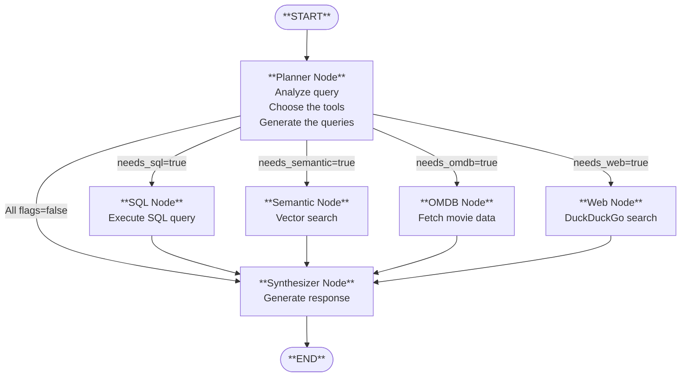

# 🎬 Albert Query - Agentic Movie Intelligence System

> An intelligent conversational agent for querying movie and TV series data using Retrieval Augmented Generation (RAG), multi-tool orchestration, and semantic search.

[](https://www.python.org/downloads/)
[](https://streamlit.io/)
[](https://www.langchain.com/)
[](https://langchain-ai.github.io/langgraph/)
[](https://www.trychroma.com/)


## Table of Contents

- [Overview](#overview)
- [Installation](#installation)
- [Monitoring with Langfuse](#monitoring-with-langfuse)
- [Features](#features)
- [Architecture](#architecture)
- [Project Structure](#project-structure)
- [Components](#components)
- [Workflow](#workflow)
- [Future Improvements](#future-improvements)
- [Contributors](#contributors)
- [License](#license)

---

## Overview

**Albert Query** is an agentic AI system we developed as part of our M1 project at **Albert School** in collaboration with **Mines Paris - PSL**. The system intelligently answers questions about movies and TV series by orchestrating multiple data sources and tools through a LangGraph-based workflow.

### What Makes It Special?

Unlike traditional chatbots, Albert Query:
- **Plans before acting** - Analyzes each question to determine which tools are needed
- **Multi-source intelligence** - Combines SQL databases, vector search, external APIs, and web search
- **Semantic understanding** - Uses OpenAI embeddings to find movies by plot similarity
- **Source attribution** - Always shows where information comes from
- **Context-aware** - Maintains conversation history for follow-up questions

### Use Cases

- 🔍 **Semantic Search**: "Find me movies about space exploration with AI themes"
- 📊 **Data Analysis**: "How many comedies were released on Netflix after 2020?"
- 🎭 **Movie Discovery**: "Show me films similar to Inception"
- 📈 **Trend Analysis**: "What are the top-rated action movies from the 2010s?"
- 🌐 **Latest Info**: "What's trending in movies this week?"

---

## Installation

### Step 1: Clone the repo
```bash
git clone https://github.com/your-username/your-repo.git
cd your-repo
```

### Step 2: Create a virtual env
```bash
python -m venv venv
source venv/bin/activate  # macOS/Linux
# or
venv\Scripts\activate  # Windows
```

### Step 3: Install dependencies
```bash
pip install -r requirements.txt
```

### Step 4: Configure environment variables
Create a `.env` file at the root and add:
```env
OPENAI_API_KEY="your_openai_api_key"
OMDB_API_KEY="your_omdb_api_key"
LANGFUSE_SECRET_KEY = "your_langfuse_secret_key"
LANGFUSE_PUBLIC_KEY = "your_langfuse_public_key"
```

### Step 5: Data files
You can use the jupyter notebooks (code/notebooks) to create the SQL and the cevtor database using the .csv files.

**OR**

Download from [this folder](https://drive.google.com/drive/folders/1Z1vqq8Q9Hw3VKBpmrqh6aiE6ee28mcCG?usp=drive_link) and place them in the `data/` folder. Don't change the file names.

### Step 6: Run the app
```bash
streamlit run code/streamlit_app.py
```

The app will open at `http://localhost:8501`

---

## Monitoring with Langfuse

The application includes integrated monitoring and observability through [Langfuse](https://langfuse.com/), allowing you to track and analyze LLM interactions in real-time.

### Setup

1. Create a free account at [cloud.langfuse.com](https://cloud.langfuse.com)
2. Generate API keys from your project settings
3. Add them to your `.env` file:
   ```env
   LANGFUSE_SECRET_KEY="sk-lf-..."
   LANGFUSE_PUBLIC_KEY="pk-lf-..."
   ```

### Features

The Langfuse integration automatically tracks:
- **LLM calls**: All GPT-4o-mini requests and responses
- **Token usage**: Input/output token counts per query
- **Latency**: Response times for each agent node
- **Conversation traces**: Full workflow execution from planner to synthesizer
- **Cost estimation**: Automatic cost tracking based on token usage

### Viewing Traces

Access your Langfuse dashboard at [cloud.langfuse.com](https://cloud.langfuse.com) to:
- View detailed traces of each user query
- Analyze tool selection patterns (SQL, semantic, OMDB, web)
- Monitor performance metrics and identify bottlenecks
- Debug errors and track edge cases

All traces are automatically organized by session ID for easy conversation tracking.

---
## Features

### Core Capabilities

🧠 **Intelligent Query Planning**
- LLM-based planner analyzes questions and conversation history
- Automatically selects optimal tools (SQL, Semantic Search, OMDB, Web)
- Avoids unnecessary API calls for efficiency

🗄️ **Multi-Database SQL Queries**
- Comprehensive catalog of 8,000+ movies/shows from Netflix, Disney+, Amazon Prime
- Structured queries with filters (year, genre, rating, type)
- Automatic database schema understanding

🔍 **Semantic Vector Search**
- 114MB of OpenAI embeddings (text-embedding-3-small)
- Find movies by plot descriptions, themes, or similarity
- Natural language queries in English or French

🎬 **OMDB API Integration**
- Enriched movie metadata (actors, awards, ratings, posters)
- IMDb links for detailed information
- Full plot summaries

🌐 **Web Search**
- DuckDuckGo integration for trending topics
- Latest movie news and releases
- Current events in cinema

📚 **Source Attribution**
- Tracks all information sources
- Visual display of databases, APIs, and search results used
- Clickable links to IMDb and search results

💬 **Conversational Memory**
- LangGraph checkpointing with MemorySaver
- Full conversation history maintained
- Context resolution ("that movie" → actual movie name)

---

## Architecture

Our system follows an **agentic architecture** using LangGraph to create a stateful, multi-tool workflow:



## Project Structure

```
Agentic_Systems_with_RAG_Lamy-Waerniers/
│
├── code/                                    # Main source code (modular architecture)
│   ├── app.py                               # Streamlit UI and main entry point
│   ├── agent.py                             # LangGraph workflow construction
│   ├── nodes.py                             # All workflow nodes (planner, SQL, semantic, OMDB, web, synthesizer)
│   ├── tools.py                             # Tool implementations (SQL query, web search, OMDB API, semantic search)
│   ├── models.py                            # Shared type definitions (AgentState, PlannerOutput, SQLOutput)
│   ├── config.py                            # Centralized configuration (API keys, paths, LLM instance)
│   ├── utils.py                             # Helper functions (catalog builder, routing logic)
│   ├── embedding.py                         # Vector embedding utilities
│   └── notebooks/                           # Jupyter notebooks for development
│       ├── embeding.ipynb                   # Embedding pipeline notebook
│       ├── SQLdb_creator.ipynb              # Database creation from CSVs
│       └── test_semantic_search.ipynb       # Semantic search validation
│
├── data/                                    # Data storage
│   ├── csv_db/                              # Source CSV files
│   │   ├── amazon_prime_titles.csv          # Amazon Prime catalog (3.9MB)
│   │   ├── netflix_titles.csv               # Netflix catalog (3.4MB)
│   │   └── disney_plus_titles.csv           # Disney+ catalog (385KB)
│   ├── databases/
│   │   └── movie.db                         # Consolidated SQLite DB (32.9MB)
│   ├── vector_database/                     # ChromaDB persistent storage
│   │   ├── chroma.sqlite3                   # Vector DB metadata (42.7MB)
│   │   └── 19c0759d-.../                    # Embedding data (114MB)
│   └── memory/                              # Conversation storage
│       ├── conversations/
│       └── user_profiles/
│
├── doc/                                     # Documentation
│   ├── graph_schema.png                     # LangGraph workflow diagram
│   ├── omdb_api_doc.json                    # OMDB API reference
│   └── OMDB_API_doc.txt
│
├── .env                                     # Environment configuration (git-ignored)
├── .gitignore                               # Git ignore rules
├── requirements.txt                         # Python dependencies (223 packages)
└── README.md                                # This file
```

### Architecture Breakdown

#### Core Modules:

- **`config.py`** - Central configuration hub
  - API keys (OpenAI, OMDB)
  - Absolute paths to data folders
  - LLM instance (ChatOpenAI)

- **`models.py`** - Shared type definitions
  - `AgentState`: TypedDict defining the workflow state
  - `PlannerOutput`: Pydantic model for planner decisions
  - `SQLOutput`: Pydantic model for SQL execution decisions

- **`tools.py`** - Tool implementations
  - `execute_sql_query()`: Query SQLite databases
  - `semantic_search()`: Vector similarity search with ChromaDB
  - `omdb_api()`: Fetch movie metadata from OMDB
  - `web_search()`: DuckDuckGo web search

- **`nodes.py`** - LangGraph workflow nodes
  - `planner_node()`: Analyzes question and decides which tools to use
  - `sql_node()`: Generates and executes SQL queries
  - `semantic_search_node()`: Performs vector search
  - `omdb_node()`: Fetches enriched movie data
  - `web_node()`: Searches the web
  - `synthesizer_node()`: Combines results into natural language response

- **`utils.py`** - Helper functions
  - `build_db_catalog()`: Introspects database schema
  - `format_catalog_for_llm()`: Formats catalog for LLM prompts
  - Routing functions for conditional edges

- **`agent.py`** - LangGraph workflow builder
  - Constructs the StateGraph
  - Defines node connections and routing
  - Compiles workflow with MemorySaver checkpointer

- **`app.py`** - Streamlit application
  - UI components (chat interface, source attribution)
  - Session state management
  - Workflow execution and streaming

---

## Future Improvements

We've identified several areas for optimization and enhancement. Here's our roadmap:

### 1. 📦 **Catalog Caching System**

**Problem:**
- Database catalog is rebuilt on every app startup
- Slow initialization (~2-5 seconds)
- Redundant SQL queries for schema introspection

**Solution:**
```python
# Implement caching with invalidation detection
def get_or_build_catalog(db_path: str, cache_path: str) -> dict:
    """
    Cache database catalog as JSON
    - Compare file modification times to detect changes
    - Load from cache if DB unchanged
    - Rebuild only when necessary
    """
```

**Expected Impact:**
- ⚡ 10-50x faster startup time
- 💾 Reduced SQL queries
- 🔄 Auto-invalidation on schema changes

**Implementation:**
- Save catalog to `data/databases/catalog_cache.json`
- Include DB file mtime and size for change detection
- Add force-rebuild option for manual invalidation

### 2. 🧠 **Persistent Long-Term Memory**

**Current State:**
- Memory stored in LangGraph's MemorySaver (in-memory only)
- Lost on application restart
- No cross-session learning

**Proposed Architecture:**
```python
# SQLite-based conversation storage
conversations/
  ├── user_123/
  │   ├── session_20250116_001.json    # Conversation history
  │   ├── session_20250116_002.json
  │   └── preferences.json              # Learned preferences
  └── user_456/
      └── ...

# Conversation schema
{
  "session_id": "20250116_001",
  "user_id": "user_123",
  "timestamp": "2025-01-16T10:30:00Z",
  "messages": [...],
  "topics": ["action movies", "2020s cinema"],
  "preferences_learned": {
    "favorite_genres": ["action", "sci-fi"],
    "preferred_platforms": ["netflix"]
  }
}
```

**Features to Add:**
- 💾 Persist conversations to disk (JSON or SQLite)
- 👤 User-specific history and preferences
- 🔍 Semantic search over past conversations
- 📊 Analytics on user interests
- 🎯 Personalized recommendations based on history

**Technical Implementation:**
- Replace MemorySaver with custom SQLiteCheckpointer
- Add user authentication (see #3)
- Implement conversation summarization for long histories
- Privacy controls (GDPR compliance)

### 3. 🔐 **User Management & API Key Interface**

**Current Limitation:**
- Single shared API keys in `.env`
- No multi-user support
- API costs not attributable to users

**Implementation:**
- Streamlit sidebar with settings panel
- Encrypted key storage per user (keyring library)
- Session-based authentication
- Token tracking and cost estimation
- Rate limiting per user

### 4. 🔄 **Workflow Enhancement: Planner Loop**

**Current Issue:**
- Linear workflow: Planner → Tools → Synthesizer → End
- No feedback loop if initial plan was insufficient
- Cannot self-correct or ask for more tools

**Proposed Architecture:**

```
User Question
     ↓
┌────────────────┐
│  PLANNER       │ ◄──────────┐
└────┬───────────┘            │
     │                        │
     ▼                        │
┌────────────────┐            │
│  TOOL EXECUTOR │            │
└────┬───────────┘            │
     │                        │
     ▼                        │
┌────────────────┐            │
│  EVALUATOR     │────────────┘
│  (New Node)    │ If insufficient data, loop back
└────┬───────────┘
     │ If sufficient
     ▼
┌────────────────┐
│  SYNTHESIZER   │
└────────────────┘
```

### 5. 📈 **Embedding Quality Improvements**

**Current Limitations:**
- Similarity scores often low (<50%)
- Movie descriptions are single sentences only
- No chunking strategy
- Basic embedding model (text-embedding-3-small)

**Improvement Strategies:**

#### A. **Enhance Movie Description Quality** (Priority #1)
Currently, we only embed the plot description field from databases (single sentence).
Use APIs to enrich our database with way longer movie descritions.
Expected Impact:
- 🎯 More contextual embeddings
- 📈 Better similarity scores (10-20% improvement)
- 🔍 Genre/cast matching in semantic search

### 6. 📋 **Structured Output Enforcement**

**Problem:**
- JSON parsing errors possible in synthesizer
- Inconsistent response formats
- Difficult to extract structured data

### 7. 🎯 **Token Optimization**

**Current Issues:**
- Prompts are verbose (500-800 tokens each)
- Full database catalog sent to planner (1000+ tokens)
- Conversation history grows unbounded

**Optimization Strategies:**

#### A. **Prompt Compression**

#### B. **Catalog Summarization**

#### C. **Conversation Summarization**

#### D. **Lazy Loading**

### 8. 🎨 **UI/UX Enhancements**

**Proposed Features:**
- 📊 **Results Table View** - Toggle between chat and table display
- 🎬 **Movie Cards** - Rich display with posters, ratings, cast
- 📈 **Query Statistics** - Show token usage, cost, response time
- 🌓 **Dark Mode** - Theme switching
- 📥 **Export Results** - Download conversations as JSON/CSV
- 🎤 **Voice Input** - Speech-to-text for queries
- 🌍 **Multi-language Support** - Full i18n for French/English
- 📱 **Mobile Responsiveness** - Optimize for mobile devices
- ⌨️ **Keyboard Shortcuts** - Power user features

### 9. 🧪 **Testing & Quality Assurance**

**Current Gap:** No automated tests

**Coverage Goals:**
- Unit tests for each node
- Integration tests for workflow
- Performance benchmarks
- Regression tests for common queries

### 10. 🔒 **Security & Privacy**

**Enhancements Needed:**
- 🔐 API key encryption at rest
- 🚫 Input sanitization (SQL injection prevention)
- 🕵️ PII detection and redaction in conversations
- 📜 Audit logging for all queries
- 🛡️ Rate limiting and abuse prevention
- 🔏 HTTPS enforcement in production
- 👁️ Content filtering for inappropriate queries

### 11. 🚀 **Performance & Scalability**

**Optimization Opportunities:**
- ⚡ **Async Tool Execution** - Run SQL, Semantic, OMDB in parallel
- 💾 **Result Caching** - Cache common queries (Redis)
- 🗜️ **Vector Index Optimization** - Use HNSW parameters tuning
- 📊 **Database Indexing** - Add indexes on common query columns
- 🔄 **Connection Pooling** - Reuse DB connections
- ☁️ **Deployment** - Docker + cloud hosting (AWS/GCP)
- 📦 **CDN Integration** - Cache static assets

### 12. 📊 **Analytics & Monitoring**

**Tracking Metrics:**
- 📈 Query latency by tool type
- 💰 Cost per query (token usage)
- 🎯 Tool selection accuracy (planner effectiveness)
- 👥 User engagement metrics
- ❌ Error rates and types
- 🔍 Most common queries and topics
- 📊 Semantic search quality metrics


## Contributors

This project was developed as part of our Master's degree at **Albert School X Mines Paris - PSL**.

**Team:**
- Vincent Lamy & Alexandre Waerniers

**Institution:**
- Albert School  X  Mines Paris PSL
(Paris - FRANCE)

---

## License

This project is licensed under the MIT License - see the LICENSE file for details.

---

<div align="center">

**⭐ If you found this project useful, please consider giving it a star! ⭐**

</div>
