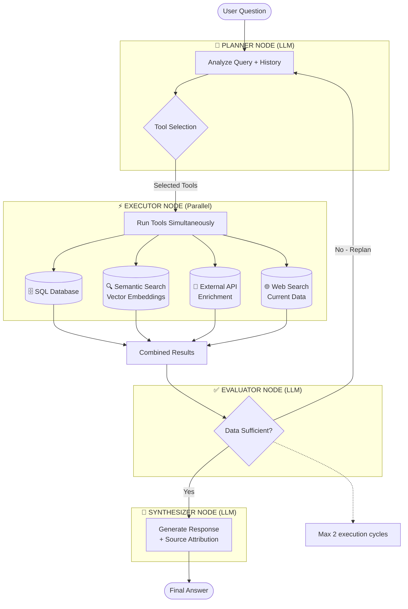

# Albert Query — Agentic NL2SQL & RAG Conversational Engine

> A production-ready blueprint for building a context-aware conversational AI layer over any structured database. Demonstrated on a multi-source entertainment dataset (Netflix, Disney+, Amazon Prime), but **engineered for direct adaptation to any closed, proprietary data environment**.

[](https://www.python.org/downloads/)
[](https://langchain-ai.github.io/langgraph/)
[](https://www.langchain.com/)
[](https://www.trychroma.com/)
[](https://streamlit.io/)

---

## What This Project Demonstrates

This system is a **"plug-and-play" AI architecture** designed for any organization looking to unlock siloed, structured data through natural language. It transforms static databases into an interactive intelligence hub — reducing data retrieval time while maintaining high precision through automated result evaluation.

The core engine is domain-agnostic. The movie dataset is simply the vehicle used to demonstrate and validate the architecture. The same system can be deployed over HR databases, financial records, product catalogs, CRM data, or any proprietary SQL/vector store.

**Built as part of an M1 program at Albert School X Mines Paris - PSL.**

---

## Core Technical Achievements

### Natural Language to SQL (NL2SQL)
Engineered a pipeline that translates complex natural language queries into optimized SQL, enabling non-technical users to query structured databases without writing a single line of code. The system introspects the schema at runtime, making it immediately portable to new database structures.

### Hybrid Semantic Search (RAG)
Implemented a vector-based retrieval system using ChromaDB (text-embedding-3-small). This captures nuances and contextual relationships that traditional keyword or SQL searches miss — critical for qualitative queries like "dark investigation atmosphere" or "emotionally complex storyline."

### Agentic Planner-Executor-Evaluator Loop
The core reasoning engine operates as a self-correcting autonomous agent. If initial results are insufficient, the system replans — selecting different or additional tools — without human intervention. Maximum 2 iterations, preventing runaway costs while guaranteeing answer quality.

### Multi-Tool Orchestration
Dynamic "tool belt" executed in **parallel** via asyncio: SQL, Vector Search, external APIs, and Web Search. The planner selects the minimum effective combination per query, not a fixed pipeline.

### Enterprise-Grade Observability
Full Langfuse integration for trace analysis, cost tracking (~$0.002/query), latency per node, and debugging of LLM decision chains.

---

## Architecture

The workflow is a stateful LangGraph graph with four specialized nodes and conditional routing:



### Node Responsibilities

**1. Planner (LLM + structured outputs)** — Analyzes query intent and conversation history. Selects the minimal effective tool combination via Pydantic-validated structured output. Uses keyword triggers for deterministic routing on high-confidence patterns.

**2. Executor (async parallel)** — Runs all selected tools simultaneously with asyncio. Isolates failures per tool so one error never blocks the full response.

**3. Evaluator (LLM)** — Assesses whether the retrieved data is sufficient to answer the original query. Triggers replanning with refined instructions if not. Acts as an automated quality gate.

**4. Synthesizer (LLM)** — Generates the final natural language response with source attribution and conversation context.

---

## Tool Selection Logic

The planner applies structured decision rules, not arbitrary LLM judgment:

| Query Type | Tool(s) Selected |
|---|---|
| Specific item metadata (names, dates, ratings) | SQL |
| Qualitative / thematic / mood-based | Semantic Search |
| Visual metadata, detailed enrichment | External API |
| Current events, real-time data | Web Search |
| Complex queries crossing multiple dimensions | Combination (parallel) |

---

## Observability with Langfuse

Production-grade LLM monitoring integrated end-to-end:

- **Trace debugging** — Full visibility into planner decisions, tool calls, evaluator reasoning
- **Cost tracking** — Token usage per node (~$0.002/query average on GPT-4o-mini)
- **Latency profiling** — Per-node breakdown (Planner ~1.1s, Executor ~2.3s, Synthesizer ~0.8s)
- **Quality assurance** — Identify replanning frequency, wrong tool selections, edge cases

**Setup:**
```env
LANGFUSE_SECRET_KEY="sk-lf-..."
LANGFUSE_PUBLIC_KEY="pk-lf-..."
```

---

## Business Applicability

This architecture is a direct blueprint for enterprise use cases:

- **Internal knowledge bases** — Let employees query company documentation, product specs, or internal policies in plain language
- **CRM / Sales data** — Natural language access to customer records, deal history, pipeline analytics
- **Financial reporting** — Query P&L, budget tables, or transactional databases without SQL expertise
- **HR & Operations** — Headcount queries, performance data, scheduling — accessible to non-technical stakeholders
- **Product catalogs** — Semantic discovery over inventory, specifications, or compatibility matrices

Adapting this system to a new domain requires: replacing the SQL databases, re-embedding domain documents for the vector store, and updating the tool descriptions. The agent logic, evaluation loop, and observability stack require no changes.

---

## Tech Stack

| Layer | Technology |
|---|---|
| Orchestration | LangGraph (StateGraph, conditional edges) |
| LLM Integration | LangChain + OpenAI GPT-4o-mini |
| Structured Outputs | Pydantic v2 |
| Vector Store | ChromaDB + text-embedding-3-small |
| Relational Data | SQLite (multi-database) |
| Observability | Langfuse |
| UI | Streamlit |
| Async Execution | Python asyncio |

---

## Project Structure

```
├── code/
│   ├── core/
│   │   ├── agent.py              # LangGraph StateGraph definition
│   │   ├── models.py             # Pydantic schemas (ExecutionPlan, EvaluatorDecision)
│   │   └── state.py              # AgentState TypedDict
│   ├── nodes/
│   │   ├── planner.py            # Structured tool selection
│   │   ├── executor.py           # Parallel async execution
│   │   ├── evaluator.py          # Result sufficiency evaluation
│   │   └── synthesizer.py        # Response generation
│   ├── tools/
│   │   ├── sql_tool.py           # Multi-DB queries with schema introspection
│   │   ├── semantic_tool.py      # ChromaDB vector similarity search
│   │   ├── omdb_tool.py          # REST API client (movie enrichment demo)
│   │   └── web_tool.py           # Web search integration
│   ├── prompts/
│   │   ├── planner_prompts.py
│   │   ├── evaluator_prompts.py
│   │   └── synthesizer_prompts.py
│   ├── config.py
│   ├── utils.py                  # Database catalog builder (runtime schema introspection)
│   └── streamlit_app.py          # Conversational UI
│
└── scripts/
    ├── create_sql_db.py          # Build SQLite databases from CSV files
    ├── create_vector_db.py       # Build ChromaDB embeddings from SQL databases
    └── test_semantic_search.py   # Diagnostic tool for vector search
```

---

## Installation

### Prerequisites
- Python 3.8+
- OpenAI API key
- OMDB API key (free at [omdbapi.com](http://www.omdbapi.com/apikey.aspx)) — demo-specific
- Langfuse account (optional, for observability)

### 1. Clone & install

```bash
git clone https://github.com/Vincent-20-100/Agentic_Systems_with_RAG_Lamy-Waerniers.git
cd Agentic_Systems_with_RAG_Lamy-Waerniers
python -m venv venv
source venv/bin/activate  # Windows: venv\Scripts\activate
pip install -r requirements.txt
```

### 2. Configure environment

Create a `.env` file at the project root:
```env
OPENAI_API_KEY="your_openai_api_key"
OMDB_API_KEY="your_omdb_api_key"
LANGFUSE_SECRET_KEY="sk-lf-..."  # Optional — observability
LANGFUSE_PUBLIC_KEY="pk-lf-..."  # Optional — observability
```

### 3. Set up data (one-time)

The app requires two data layers: a SQLite database and a ChromaDB vector store.

**If starting from raw CSVs** (place your `.csv` files in `data/csv_db/`):
```bash
python scripts/create_sql_db.py       # CSV → SQLite (data/databases/movie.db)
python scripts/create_vector_db.py    # SQLite → ChromaDB embeddings (data/vector_database/)
```

**If the pre-built data files are already present** (`data/databases/` and `data/vector_database/`), skip this step.

To verify the vector store is working correctly:
```bash
python scripts/test_semantic_search.py
```

### 4. Run

```bash
streamlit run code/streamlit_app.py
```

---

## Future Improvements

| Feature | Impact |
|---|---|
| Catalog caching (JSON + file-watch invalidation) | 10-50x faster startup |
| Persistent conversation memory (SQLite) | Cross-session context retention |
| Token optimization (prompt compression, lazy catalog loading) | 30-50% cost reduction |
| Full embedding enrichment (plot + cast + themes) | 10-20% better semantic retrieval |
| Automated test suite (unit + integration + regression) | Production confidence |
| Docker deployment + API gateway | Cloud-ready packaging |

---

## Contributors

**Vincent Lamy & Alexandre Waerniers**
M1 AI Engineering — Albert School X Mines Paris - PSL (Paris, France)

---

## License

MIT License — see [LICENSE](LICENSE) for details.
