# 🎬 Albert Query - Agentic Movie Intelligence System

> An intelligent conversational agent for querying movie and TV series data using Retrieval Augmented Generation (RAG), multi-tool orchestration, and semantic search.

[](https://www.python.org/downloads/)
[](https://streamlit.io/)
[](https://www.langchain.com/)
[](https://langchain-ai.github.io/langgraph/)
[](https://www.trychroma.com/)


## Table of Contents

- [Quick Start](#-quick-start)
- [Overview](#overview)
- [Installation](#installation)
- [Monitoring with Langfuse](#-monitoring-with-langfuse)
- [Features](#features)
- [Architecture & Technical Details](#-architecture--technical-details)
- [Project Structure](#project-structure)
- [Future Improvements](#future-improvements)
- [Contributors](#contributors)
- [License](#license)

---

## 🚀 Quick Start

### What is Albert Query?

Albert Query is an intelligent movie search assistant that doesn't just match keywords—it understands what you're looking for. Think of it as having a movie expert on your team who can search through databases, understand moods and themes, fetch posters and details, and even check the latest trending films—all in response to natural language questions.

### Key Concepts Explained

**RAG (Retrieval-Augmented Generation):**
Instead of relying solely on trained knowledge, the AI retrieves real data from databases before answering. This ensures accurate, up-to-date responses grounded in actual movie information.

**Agentic AI:**
The system doesn't just answer—it plans how to answer, executes the plan using various tools, evaluates if the results are sufficient, and can self-correct by replanning if needed.

**Vector Search (Semantic Search):**
Find movies by meaning, not just keywords. Ask for "dark investigation atmosphere" and get relevant thrillers, even if those exact words aren't in the database.

**Multi-Tool Orchestration:**
Different questions need different tools. Albert Query automatically chooses:
- **SQL Database**: For structured queries (genre filters, year ranges, counts)
- **Semantic Search**: For qualitative searches (mood, atmosphere, themes)
- **OMDB API**: For posters, cast, directors, plot details
- **Web Search**: For trending and latest releases

### Quick Demo

**Example Query:** *"Show me dark sci-fi movies from 2015-2020 with suspenseful atmosphere"*

**What happens:**
1. **Planner** analyzes the query and decides: Use SQL (for year filter) + Semantic Search (for "dark sci-fi suspenseful")
2. **Executor** runs both tools in parallel
3. **Evaluator** checks if results are sufficient
4. **Synthesizer** combines results into a natural answer with sources

**Result:** You get a curated list of sci-fi films matching both the time period and the atmospheric qualities you described.

### Ready to Try?

Jump to [Installation](#installation) to set up Albert Query, or continue reading for technical details on how the system works.

---

## Overview

**Albert Query** is an agentic AI system we developed as part of our M1 project at **Albert School** in collaboration with **Mines Paris - PSL**. The system intelligently answers questions about movies and TV series by orchestrating multiple data sources and tools through a LangGraph-based workflow.

### What Makes It Special?

Unlike traditional chatbots, Albert Query:
- **Agentic architecture** - Planner→Executor→Evaluator→Synthesizer workflow with self-correction
- **Self-correcting loops** - Evaluator can request additional data if initial results insufficient (max 2 iterations)
- **Parallel execution** - All selected tools run simultaneously for faster responses
- **Multi-source intelligence** - Combines SQL databases, vector search, external APIs, and web search
- **Semantic understanding** - Uses OpenAI embeddings to find movies by plot similarity
- **Source attribution** - Always shows where information comes from
- **Context-aware** - Maintains conversation history for follow-up questions

### Use Cases

- 🔍 **Semantic Search**: "Find me movies about space exploration with AI themes"
- 📊 **Data Analysis**: "How many comedies were released on Netflix after 2020?"
- 🎭 **Movie Discovery**: "Show me films similar to Inception"
- 📈 **Trend Analysis**: "What are the top-rated action movies from the 2010s?"
- 🌐 **Latest Info**: "What's trending in movies this week?"

---

## Installation

### Step 1: Clone the repo
```bash
git clone https://github.com/your-username/your-repo.git
cd your-repo
```

### Step 2: Create a virtual env
```bash
python -m venv venv
source venv/bin/activate  # macOS/Linux
# or
venv\Scripts\activate  # Windows
```

### Step 3: Install dependencies
```bash
pip install -r requirements.txt
```

### Step 4: Configure environment variables
Create a `.env` file at the root and add:
```env
OPENAI_API_KEY="your_openai_api_key"
OMDB_API_KEY="your_omdb_api_key"
LANGFUSE_SECRET_KEY="your_langfuse_secret_key"
LANGFUSE_PUBLIC_KEY="your_langfuse_public_key"
```

### Step 5: Data files
You can use the jupyter notebooks (code/notebooks) to create the SQL and the vector database using the .csv files.

**OR**

Download from [this folder](https://drive.google.com/drive/folders/1Z1vqq8Q9Hw3VKBpmrqh6aiE6ee28mcCG?usp=drive_link) and place them in the `data/` folder. Don't change the file names.

### Step 6: Run the app
```bash
streamlit run code/streamlit_app.py
```

The app will open at `http://localhost:8501`

---

## 🔍 Monitoring with Langfuse

### What is Langfuse?

Langfuse is an observability platform for LLM applications that tracks every step of the AI workflow. It helps you understand what's happening under the hood, identify issues, and optimize performance.

### Why Use It?

- **Debugging**: See which tools were selected and why the Planner made specific decisions
- **Cost Tracking**: Monitor OpenAI API usage per query to control spending
- **Performance**: Measure latency of each node (Planner, Executor, Evaluator, Synthesizer)
- **Quality**: Identify wrong tool choices or insufficient results that trigger replanning

### What You See in Langfuse

When you run a query, Langfuse captures:

- **Complete Traces**: Full workflow from Planner → Executor → Evaluator → Synthesizer
- **Token Usage**: Input/output tokens per LLM call (Planner, Evaluator, Synthesizer)
- **Execution Time**: Latency breakdown per node
- **Tool Selection Decisions**: Which tools were chosen and the reasoning
- **Errors & Edge Cases**: Failed API calls, replanning loops, insufficient data

### Practical Use Cases

1. **Debug Tool Selection**: "Why did it use SQL instead of Semantic Search for this query?"
   - Check Planner trace → see reasoning field → understand keyword triggers

2. **Optimize Performance**: "Which tool is slowing down the workflow?"
   - Compare Executor node timings → identify bottleneck (SQL query, API call, etc.)

3. **Quality Assurance**: "Is replanning happening too frequently?"
   - Filter traces by iteration_count > 1 → analyze what queries trigger replanning

4. **Cost Management**: "Can we optimize prompts to reduce token usage?"
   - Sum token usage across queries → identify verbose prompts → refine
   - See the token optimization strategies in the Architecture section for ways to reduce prompt verbosity.

### Example Insights

Here's what Langfuse shows for a typical query:

**Query**: *"Dark sci-fi movies from 2015-2020"*

- **Tools Used**: SQL + Semantic Search ✅
- **Token Usage**:
  - Planner: 340 input, 85 output
  - Synthesizer: 180 input, 95 output
  - Total: ~$0.002 (GPT-4o-mini)
- **Execution Time**:
  - Planner: 1.1s
  - Executor (parallel): 2.3s (SQL 1.8s, Semantic 2.1s)
  - Evaluator: 0.4s
  - Synthesizer: 0.8s
  - **Total: 4.6s**
- **Replanning**: None (data sufficient on first attempt)

**Insight**: Semantic search is the bottleneck (2.1s). Could optimize by reducing embedding dimensions or using cached results.

### Setup

1. Create a free account at [cloud.langfuse.com](https://cloud.langfuse.com)
2. Generate API keys from your project settings
3. Add them to your `.env` file:
   ```env
   LANGFUSE_SECRET_KEY="sk-lf-..."
   LANGFUSE_PUBLIC_KEY="pk-lf-..."
   ```

---
## Features

### Core Capabilities

🧠 **Intelligent Query Planning**
- LLM-based planner analyzes questions and conversation history
- Automatically selects optimal tools (SQL, Semantic Search, OMDB, Web)
- Avoids unnecessary API calls for efficiency

🗄️ **Multi-Database SQL Queries**
- Comprehensive catalog of 8,000+ movies/shows from Netflix, Disney+, Amazon Prime
- Structured queries with filters (year, genre, rating, type)
- Automatic database schema understanding

🔍 **Semantic Vector Search**
- 114MB of OpenAI embeddings (text-embedding-3-small)
- Find movies by plot descriptions, themes, or similarity
- Natural language queries in English or French

🎬 **OMDB API Integration**
- Enriched movie metadata (actors, awards, ratings, posters)
- IMDb links for detailed information
- Full plot summaries

🌐 **Web Search**
- DuckDuckGo integration for trending topics
- Latest movie news and releases
- Current events in cinema

📚 **Source Attribution**
- Tracks all information sources
- Visual display of databases, APIs, and search results used
- Clickable links to IMDb and search results

💬 **Conversational Memory**
- LangGraph checkpointing with MemorySaver
- Full conversation history maintained
- Context resolution ("that movie" → actual movie name)

---

## 🏗️ Architecture & Technical Details

### How the Agentic Workflow Works

Albert Query implements an agentic RAG system using LangGraph, structured as a state machine with four specialized nodes:

```mermaid
graph TB
    Start([User Question]) --> Planner

    subgraph Planning["🧠 PLANNER NODE (LLM)"]
        Planner[Analyze Query + History]
        Planner --> Decision{Tool Selection}
    end

    Decision -->|Selected Tools| Executor

    subgraph Execution["⚡ EXECUTOR NODE (Parallel)"]
        Executor[Run Tools Simultaneously]
        Executor --> SQL[(🗄️ SQL Database<br/>8,000+ movies)]
        Executor --> Semantic[(🔍 Semantic Search<br/>Vector Embeddings)]
        Executor --> OMDB[(🎬 OMDB API<br/>Metadata & Posters)]
        Executor --> Web[(🌐 Web Search<br/>Latest & Trending)]
    end

    SQL --> Results[Combined Results]
    Semantic --> Results
    OMDB --> Results
    Web --> Results

    Results --> Evaluator

    subgraph Evaluation["✅ EVALUATOR NODE (LLM)"]
        Evaluator{Data Sufficient?}
    end

    Evaluator -->|No - Replan| Planner
    Evaluator -->|Yes| Synthesizer

    subgraph Synthesis["📝 SYNTHESIZER NODE (LLM)"]
        Synthesizer[Generate Response<br/>+ Sources]
    end

    Synthesizer --> End([Final Answer])

    Note1[Max 2 execution cycles]
    Evaluator -.-> Note1
```



#### The Four-Node Workflow:

1. **Planner Node (LLM-Powered)**
   - **Input**: User question + conversation history + database catalog
   - **Output**: `ExecutionPlan` (structured output via OpenAI function calling)
   - **Logic**: Analyzes query intent, selects appropriate tools, generates tool-specific parameters
   - **Key Feature**: Uses mandatory keyword triggers (e.g., "poster" → OMDB, "mood" → Semantic)

2. **Executor Node (Parallel Execution)**
   - **Input**: `ExecutionPlan` from Planner
   - **Output**: Combined results from all selected tools
   - **Logic**: Executes tools in parallel using asyncio for optimal performance
   - **Tools Available**:
     - SQL Database (8,000+ movies across multiple SQLite DBs)
     - Semantic Search (ChromaDB vector store with embeddings)
     - OMDB API (posters, cast, plot details, awards)
     - Web Search (latest releases, trending movies)

3. **Evaluator Node (LLM-Powered)**
   - **Input**: Execution results + original question
   - **Output**: `EvaluationResult` with sufficiency assessment
   - **Logic**: Determines if results are sufficient or if replanning is needed
   - **Self-Correction**: Can trigger 1 replan if needed (max 2 execution cycles total)

4. **Synthesizer Node (LLM-Powered)**
   - **Input**: All tool results + original question
   - **Output**: Natural language response with cited sources
   - **Logic**: Combines information from multiple sources into a coherent answer
   - **Key Feature**: Always cites sources (database names, OMDB, web search)

### Tool Selection Logic

The Planner uses **mandatory keyword-based rules** for deterministic tool selection:

**Mandatory Rules:**
- **Poster/Image requests** → Always OMDB (databases don't store images)
  - Keywords: "poster", "affiche", "image", "cover", "artwork"

- **Qualitative searches** → Always Semantic Search (vector similarity)
  - Keywords: "mood", "atmosphere", "theme", "like", "similar", "vibe"

- **Structured queries** → SQL Database (filters, counts, aggregations)
  - Keywords: "how many", "count", "genre", "year", "rating", "top N"

- **Current events** → Web Search (rarely needed for movies)
  - Keywords: "latest", "trending", "news", "2026"

**Planner Decision Examples:**

| Query | Selected Tools | Reasoning |
|-------|---------------|-----------|
| "Show me the poster for Ex Machina" | OMDB only | "poster" keyword → mandatory OMDB |
| "Dark investigation movies" | Semantic only | "Dark investigation" = qualitative search |
| "How many genres in database?" | SQL only (all DBs) | "How many" → SQL aggregation across all DBs |
| "Poster for top thriller" | SQL + OMDB | SQL finds top thriller, OMDB fetches poster |
| "Dark sci-fi from 2020" | SQL + Semantic | SQL filters year, Semantic finds "dark sci-fi" vibe |

### Example Query Walkthrough

**Query:** *"Show me dark sci-fi movies from 2015-2020 with suspenseful atmosphere"*

**Step-by-Step Execution:**

1. **Planner Analysis** (Temperature=0 for consistency)
   ```json
   {
     "use_sql": true,
     "sql_database": "ALL",
     "sql_query": "SELECT title, year, rating FROM movies WHERE genre LIKE '%Sci-Fi%' AND year BETWEEN 2015 AND 2020",
     "use_semantic": true,
     "semantic_query": "dark sci-fi suspenseful atmosphere dystopian thriller",
     "reasoning": "SQL filters by year/genre, Semantic captures mood/atmosphere"
   }
   ```

2. **Executor Runs in Parallel**
   - SQL query executed across 3 databases → ~150 sci-fi films (2015-2020)
   - Semantic search in ChromaDB → Top 10 films matching "dark suspenseful" vibe
   - Results combined with metadata (title, year, rating, plot)

3. **Evaluator Assessment**
   ```json
   {
     "data_sufficient": true,
     "confidence": 0.85,
     "reasoning": "SQL provided time/genre filter, Semantic provided atmospheric matches, high confidence in result quality"
   }
   ```

4. **Synthesizer Output**
   - Merges SQL + Semantic results
   - Prioritizes films appearing in both (high confidence)
   - Cites sources: "Found in database MovieLens, confirmed by semantic similarity"
   - Formats as natural response with titles, years, brief descriptions

**Langfuse Trace Example:**
- Total latency: 4.2s (Planner 1.1s, Executor 2.3s, Evaluator 0.4s, Synthesizer 0.8s)
- Token usage: 450 input, 120 output (~$0.002 cost (GPT-4o-mini))
- Tools: SQL + Semantic (no replanning needed)

## Project Structure

```
Agentic_Systems_with_RAG_Lamy-Waerniers/
│
├── code/                                    # Main source code (modular architecture)
│   ├── core/                                # Core system components
│   │   ├── agent.py                         # LangGraph workflow construction
│   │   ├── models.py                        # Pydantic models (PlannerOutput, EvaluationResult)
│   │   └── state.py                         # AgentState TypedDict definition
│   ├── nodes/                               # LangGraph workflow nodes
│   │   ├── planner.py                       # Query analysis and tool selection
│   │   ├── executor.py                      # Parallel tool execution
│   │   ├── evaluator.py                     # Result sufficiency evaluation
│   │   └── synthesizer.py                   # Response generation with sources
│   ├── tools/                               # Tool implementations
│   │   ├── sql_tool.py                      # SQLite database queries
│   │   ├── semantic_tool.py                 # ChromaDB vector search
│   │   ├── omdb_tool.py                     # OMDB API integration
│   │   └── web_tool.py                      # DuckDuckGo web search
│   ├── prompts/                             # Prompt templates
│   │   ├── planner_prompts.py               # Planner node prompts
│   │   ├── evaluator_prompts.py             # Evaluator node prompts
│   │   └── synthesizer_prompts.py           # Synthesizer node prompts
│   ├── notebooks/                           # Jupyter notebooks for development
│   │   ├── embeding.ipynb                   # Embedding pipeline notebook
│   │   ├── SQLdb_creator.ipynb              # Database creation from CSVs
│   │   ├── test_semantic_search.ipynb       # Semantic search validation
│   │   └── testing.ipynb                    # General testing and experiments
│   ├── streamlit_app.py                     # Streamlit UI and main entry point
│   ├── config.py                            # Centralized configuration (API keys, paths)
│   ├── utils.py                             # Helper functions (catalog builder)
│   └── embedding.py                         # Vector embedding utilities
│
├── data/                                    # Data storage
│   ├── csv_db/                              # Source CSV files
│   │   ├── amazon_prime_titles.csv          # Amazon Prime catalog (3.9MB)
│   │   ├── netflix_titles.csv               # Netflix catalog (3.4MB)
│   │   └── disney_plus_titles.csv           # Disney+ catalog (385KB)
│   ├── databases/
│   │   └── movie.db                         # Consolidated SQLite DB (32.9MB)
│   ├── vector_database/                     # ChromaDB persistent storage
│   │   ├── chroma.sqlite3                   # Vector DB metadata (42.7MB)
│   │   └── 19c0759d-.../                    # Embedding data (114MB)
│   └── memory/                              # Conversation storage (future)
│       ├── conversations/
│       └── user_profiles/
│
├── docs/                                    # Documentation
│   ├── plans/                               # Design and implementation documents
│   └── REPOSITORY_AUDIT.md                  # Repository audit and cleanup plan
│
├── doc/                                     # Legacy documentation (to be consolidated)
│   ├── graph_schema.png                     # LangGraph workflow diagram
│   ├── omdb_api_doc.json                    # OMDB API reference
│   └── OMDB_API_doc.txt
│
├── .env                                     # Environment configuration (git-ignored)
├── .gitignore                               # Git ignore rules
├── requirements.txt                         # Python dependencies
└── README.md                                # This file
```

### Architecture Breakdown

#### Core Modules:

**Configuration & State:**
- **`config.py`** - Central configuration hub
  - API keys (OpenAI, OMDB, Langfuse)
  - Absolute paths to data folders
  - LLM instance (ChatOpenAI)

- **`core/state.py`** - State management
  - `AgentState`: TypedDict defining the workflow state
  - Tracks question, conversation history, results, and iteration count

- **`core/models.py`** - Pydantic models
  - `PlannerOutput`: Structured planner decisions (tool selection, queries)
  - `EvaluationResult`: Evaluator output (sufficiency assessment)
  - Enforces type safety via OpenAI function calling

**Workflow Nodes:**
- **`nodes/planner.py`** - Planner node
  - Analyzes question + history using LLM
  - Selects tools based on mandatory keyword rules
  - Outputs structured ExecutionPlan

- **`nodes/executor.py`** - Executor node
  - Runs selected tools in parallel (asyncio)
  - Combines results from all sources
  - Handles errors gracefully

- **`nodes/evaluator.py`** - Evaluator node
  - Assesses if results are sufficient
  - Can trigger replanning (max 2 cycles)
  - Prevents infinite loops

- **`nodes/synthesizer.py`** - Synthesizer node
  - Combines tool results into natural response
  - Cites sources (database names, APIs, web)
  - Formats answer for readability

**Tool Implementations:**
- **`tools/sql_tool.py`** - SQL database access
  - Queries across 3 SQLite databases (Netflix, Amazon, Disney+)
  - Supports filters (genre, year, rating, type)
  - Schema introspection

- **`tools/semantic_tool.py`** - Vector search
  - ChromaDB integration with OpenAI embeddings
  - Similarity search over 8,000+ movie plots
  - Returns top K results with scores

- **`tools/omdb_tool.py`** - OMDB API
  - Fetches metadata (cast, awards, ratings, posters)
  - Handles API rate limits
  - Returns structured JSON

- **`tools/web_tool.py`** - Web search
  - DuckDuckGo integration
  - Latest movie news and trends
  - Fallback for current events

**Prompts:**
- **`prompts/planner_prompts.py`** - Planner instructions
  - Tool selection guidelines with examples
  - Mandatory keyword rules
  - Few-shot demonstrations

- **`prompts/evaluator_prompts.py`** - Evaluation criteria
- **`prompts/synthesizer_prompts.py`** - Response formatting

**Utilities:**
- **`utils.py`** - Helper functions
  - `build_db_catalog()`: Schema introspection
  - Routing functions for conditional edges

- **`embedding.py`** - Embedding utilities
  - OpenAI embedding generation
  - Vector storage management

**Application:**
- **`core/agent.py`** - LangGraph workflow builder
  - Constructs StateGraph with all nodes
  - Defines edges and routing logic
  - Compiles with MemorySaver checkpointer

- **`streamlit_app.py`** - Streamlit UI
  - Chat interface with conversation history
  - Source attribution display
  - Langfuse integration for observability

---

## Future Improvements

We've identified several areas for optimization and enhancement. Here's our roadmap:

### 1. 📦 **Catalog Caching System**

**Problem:**
- Database catalog is rebuilt on every app startup
- Slow initialization (~2-5 seconds)
- Redundant SQL queries for schema introspection

**Solution:**
```python
# Implement caching with invalidation detection
def get_or_build_catalog(db_path: str, cache_path: str) -> dict:
    """
    Cache database catalog as JSON
    - Compare file modification times to detect changes
    - Load from cache if DB unchanged
    - Rebuild only when necessary
    """
```

**Expected Impact:**
- ⚡ 10-50x faster startup time
- 💾 Reduced SQL queries
- 🔄 Auto-invalidation on schema changes

**Implementation:**
- Save catalog to `data/databases/catalog_cache.json`
- Include DB file mtime and size for change detection
- Add force-rebuild option for manual invalidation

### 2. 🧠 **Persistent Long-Term Memory**

**Current State:**
- Memory stored in LangGraph's MemorySaver (in-memory only)
- Lost on application restart
- No cross-session learning

**Proposed Architecture:**
```python
# SQLite-based conversation storage
conversations/
  ├── user_123/
  │   ├── session_20250116_001.json    # Conversation history
  │   ├── session_20250116_002.json
  │   └── preferences.json              # Learned preferences
  └── user_456/
      └── ...

# Conversation schema
{
  "session_id": "20250116_001",
  "user_id": "user_123",
  "timestamp": "2025-01-16T10:30:00Z",
  "messages": [...],
  "topics": ["action movies", "2020s cinema"],
  "preferences_learned": {
    "favorite_genres": ["action", "sci-fi"],
    "preferred_platforms": ["netflix"]
  }
}
```

**Features to Add:**
- 💾 Persist conversations to disk (JSON or SQLite)
- 👤 User-specific history and preferences
- 🔍 Semantic search over past conversations
- 📊 Analytics on user interests
- 🎯 Personalized recommendations based on history

**Technical Implementation:**
- Replace MemorySaver with custom SQLiteCheckpointer
- Add user authentication (see #3)
- Implement conversation summarization for long histories
- Privacy controls (GDPR compliance)

### 3. 🔐 **User Management & API Key Interface**

**Current Limitation:**
- Single shared API keys in `.env`
- No multi-user support
- API costs not attributable to users

**Implementation:**
- Streamlit sidebar with settings panel
- Encrypted key storage per user (keyring library)
- Session-based authentication
- Token tracking and cost estimation
- Rate limiting per user

### 4. 🔄 **Workflow Enhancement: Planner Loop**

**Current Issue:**
- Linear workflow: Planner → Tools → Synthesizer → End
- No feedback loop if initial plan was insufficient
- Cannot self-correct or ask for more tools

**Proposed Architecture:**

```
User Question
     ↓
┌────────────────┐
│  PLANNER       │ ◄──────────┐
└────┬───────────┘            │
     │                        │
     ▼                        │
┌────────────────┐            │
│  TOOL EXECUTOR │            │
└────┬───────────┘            │
     │                        │
     ▼                        │
┌────────────────┐            │
│  EVALUATOR     │────────────┘
│  (New Node)    │ If insufficient data, loop back
└────┬───────────┘
     │ If sufficient
     ▼
┌────────────────┐
│  SYNTHESIZER   │
└────────────────┘
```

### 5. 📈 **Embedding Quality Improvements**

**Current Limitations:**
- Similarity scores often low (<50%)
- Movie descriptions are single sentences only
- No chunking strategy
- Basic embedding model (text-embedding-3-small)

**Improvement Strategies:**

#### A. **Enhance Movie Description Quality** (Priority #1)
Currently, we only embed the plot description field from databases (single sentence).
Use APIs to enrich our database with way longer movie descritions.
Expected Impact:
- 🎯 More contextual embeddings
- 📈 Better similarity scores (10-20% improvement)
- 🔍 Genre/cast matching in semantic search

### 6. 📋 **Structured Output Enforcement**

**Problem:**
- JSON parsing errors possible in synthesizer
- Inconsistent response formats
- Difficult to extract structured data

### 7. 🎯 **Token Optimization**

**Current Issues:**
- Prompts are verbose (500-800 tokens each)
- Full database catalog sent to planner (1000+ tokens)
- Conversation history grows unbounded

**Optimization Strategies:**

#### A. **Prompt Compression**

#### B. **Catalog Summarization**

#### C. **Conversation Summarization**

#### D. **Lazy Loading**

### 8. 🎨 **UI/UX Enhancements**

**Proposed Features:**
- 📊 **Results Table View** - Toggle between chat and table display
- 🎬 **Movie Cards** - Rich display with posters, ratings, cast
- 📈 **Query Statistics** - Show token usage, cost, response time
- 🌓 **Dark Mode** - Theme switching
- 📥 **Export Results** - Download conversations as JSON/CSV
- 🎤 **Voice Input** - Speech-to-text for queries
- 🌍 **Multi-language Support** - Full i18n for French/English
- 📱 **Mobile Responsiveness** - Optimize for mobile devices
- ⌨️ **Keyboard Shortcuts** - Power user features

### 9. 🧪 **Testing & Quality Assurance**

**Current Gap:** No automated tests

**Coverage Goals:**
- Unit tests for each node
- Integration tests for workflow
- Performance benchmarks
- Regression tests for common queries

### 10. 🔒 **Security & Privacy**

**Enhancements Needed:**
- 🔐 API key encryption at rest
- 🚫 Input sanitization (SQL injection prevention)
- 🕵️ PII detection and redaction in conversations
- 📜 Audit logging for all queries
- 🛡️ Rate limiting and abuse prevention
- 🔏 HTTPS enforcement in production
- 👁️ Content filtering for inappropriate queries

### 11. 🚀 **Performance & Scalability**

**Optimization Opportunities:**
- ⚡ **Async Tool Execution** - Run SQL, Semantic, OMDB in parallel
- 💾 **Result Caching** - Cache common queries (Redis)
- 🗜️ **Vector Index Optimization** - Use HNSW parameters tuning
- 📊 **Database Indexing** - Add indexes on common query columns
- 🔄 **Connection Pooling** - Reuse DB connections
- ☁️ **Deployment** - Docker + cloud hosting (AWS/GCP)
- 📦 **CDN Integration** - Cache static assets

### 12. 📊 **Analytics & Monitoring**

**Tracking Metrics:**
- 📈 Query latency by tool type
- 💰 Cost per query (token usage)
- 🎯 Tool selection accuracy (planner effectiveness)
- 👥 User engagement metrics
- ❌ Error rates and types
- 🔍 Most common queries and topics
- 📊 Semantic search quality metrics


## Contributors

This project was developed as part of our Master's degree at **Albert School X Mines Paris - PSL**.

**Team:**
- Vincent Lamy & Alexandre Waerniers

**Institution:**
- Albert School  X  Mines Paris PSL
(Paris - FRANCE)

---

## License

This project is licensed under the MIT License - see the LICENSE file for details.

---

<div align="center">

**⭐ If you found this project useful, please consider giving it a star! ⭐**

</div>
