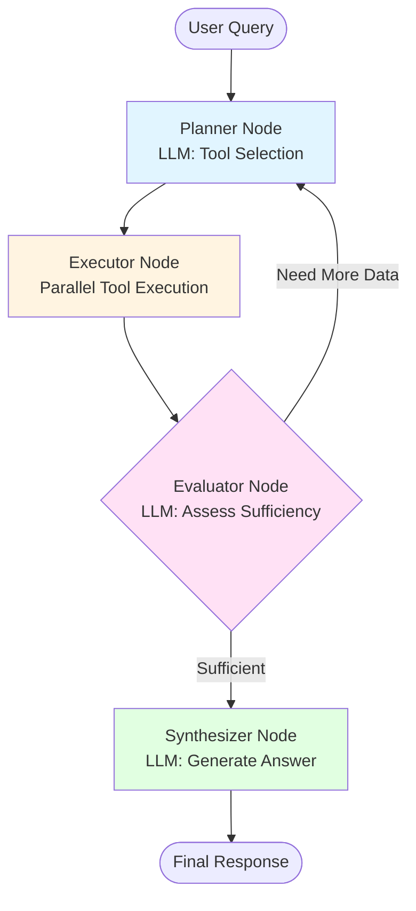

# Agentic System Redesign - Architecture Document

**Date**: 2026-02-14
**Author**: Claude (in collaboration with Vincent Lamy)
**Status**: Approved Design - Ready for Implementation
**Goal**: Transform the current RAG system into a clean, portfolio-worthy agentic architecture

---

## Table of Contents

1. [Executive Summary](#executive-summary)
2. [Current System Analysis](#current-system-analysis)
3. [Proposed Architecture](#proposed-architecture)
4. [State Management](#state-management)
5. [Node Implementations](#node-implementations)
6. [Tool Implementations](#tool-implementations)
7. [Project Structure](#project-structure)
8. [Testing Strategy](#testing-strategy)
9. [Implementation Phases](#implementation-phases)
10. [Future Enhancements](#future-enhancements)

---

## Executive Summary

### Project Goals

This redesign aims to create a **portfolio-worthy agentic AI system** that demonstrates:
- ✅ **Clean agentic architecture** - Proper separation of planning, execution, and evaluation
- ✅ **Solid engineering practices** - Modular code, clear abstractions, maintainable structure
- ✅ **Self-correction capabilities** - Agent can evaluate results and refine its approach
- ✅ **Modern patterns** - Structured outputs, parallel execution, iterative refinement

**Target Audience**: AI Engineer and Software Engineer recruiters

### Core Problems Being Solved

| Current Issue | Solution |
|--------------|----------|
| Tools defined but not used as true agent tools | Restructure as proper planner-executor pattern |
| Hardcoded sequential routing (sql→semantic→omdb→web) | LLM-powered dynamic tool selection |
| No self-correction or refinement | Add Evaluator node with loop-back capability |
| Boolean flags for planning (`needs_sql=True`) | Structured ExecutionPlan with reasoning |
| Tools run sequentially | Parallel execution with asyncio |

### Design Approach

**Selected Pattern**: **Structured Planner-Executor-Evaluator Pattern**

```
User Query
    ↓
Planner (LLM: Choose tools)
    ↓
Executor (Run tools in parallel)
    ↓
Evaluator (LLM: Sufficient? → Continue or Replan)
    ↓
Synthesizer (LLM: Generate answer) OR Loop back to Planner
```

This pattern demonstrates:
- Clear architectural thinking
- Efficient parallel execution
- Self-correction through reflection
- Industry-standard agentic patterns

---

## Current System Analysis

### Existing Architecture


**Issues Identified**:

1. **Tool/Node Confusion**: Tools are defined with `@tool` decorator but not used as LangChain tools - just wrapped in nodes
2. **Hardcoded Sequential Flow**: Fixed order (sql→semantic→omdb→web) regardless of what's needed
3. **No Agent Autonomy**: Planner just sets boolean flags, no real decision-making
4. **No Self-Correction**: Linear flow with no way to refine or retry
5. **Inefficient**: Tools run sequentially even when independent
6. **Bloated Prompts**: 500+ token prompts with hardcoded examples

### Files to Refactor

- `code/agent.py` - Workflow construction
- `code/nodes.py` - All nodes in one 400+ line file
- `code/tools.py` - Tool definitions (need async wrappers)
- `code/models.py` - State structure needs enhancement
- `code/utils.py` - Routing logic to simplify

---

## Proposed Architecture

### System Flow



### Node Responsibilities

#### 1. Planner Node (LLM-powered)
- **Input**: User query + conversation history + previous iteration context (if looping)
- **Process**: LLM analyzes and decides which tools to use
- **Output**: Structured `ExecutionPlan` with tool selections and specific queries
- **Model**: GPT-4o-mini (future: can optimize with GPT-4 for complex planning)

#### 2. Executor Node (Pure execution)
- **Input**: `ExecutionPlan` from Planner
- **Process**: Execute selected tools **in parallel** using `asyncio.gather()`
- **Output**: Raw tool results (JSON strings)
- **No LLM call** - just orchestration

#### 3. Evaluator Node (LLM-powered)
- **Input**: Original query + execution plan + tool results
- **Process**: LLM decides if information is sufficient
- **Output**: Decision (`continue` to synthesis OR `replan` with new instructions)
- **Model**: GPT-4o-mini (future: can optimize with cheaper model)

#### 4. Synthesizer Node (LLM-powered)
- **Input**: User query + all tool results + sources
- **Process**: LLM generates natural language response
- **Output**: Final answer as `AIMessage`
- **Model**: GPT-4o-mini (future: can optimize with GPT-3.5-turbo)

### Loop Protection

- **Max iterations**: 2 (one initial plan + one retry if needed)
- **Loop context preservation**: Keep tool results from previous iterations to avoid redundant API calls
- **Forced termination**: After max iterations, proceed to synthesis even if Evaluator wants more data

### Key Improvements

| Feature | Current System | New Architecture |
|---------|---------------|------------------|
| Tool Selection | Hardcoded routing | LLM-powered dynamic selection |
| Execution Model | Sequential | Parallel (asyncio) |
| Self-Correction | None | Evaluator can trigger replan |
| Planning Output | Boolean flags | Structured plan with reasoning |
| Efficiency | Tools run one by one | All tools run simultaneously |
| Transparency | Hidden logic | Clear execution plan shown to user |

---

## State Management

### AgentState Structure

```python
class AgentState(TypedDict):
    """Workflow state that flows through all nodes"""

    # Conversation
    messages: Annotated[Sequence[BaseMessage], add_messages]

    # User input
    original_question: str

    # Database metadata (loaded once at startup)
    db_catalog: dict

    # Iteration tracking
    iteration_count: int  # Track loop iterations
    max_iterations: int   # Default 2

    # Planning (from Planner node)
    execution_plan: dict  # Structured plan instead of boolean flags

    # Execution (from Executor node)
    tool_results: dict    # {tool_name: result_json}

    # Evaluation (from Evaluator node)
    evaluator_decision: str     # "continue" or "replan"
    evaluator_reasoning: str    # Why decision was made
    replan_instructions: str    # Instructions for replanning

    # History (for loop context)
    previous_plans: list        # Track all previous execution plans
    previous_results: dict      # Cumulative tool results across iterations

    # Output
    sources_used: list
    sources_detailed: list
```

### Pydantic Models

#### ExecutionPlan (Planner Output)

```python
class ExecutionPlan(BaseModel):
    """Planner's structured decision"""

    # Tools to execute
    use_sql: bool = False
    use_semantic: bool = False
    use_omdb: bool = False
    use_web: bool = False

    # Prepared queries for each tool
    sql_query: Optional[str] = None
    sql_database: Optional[str] = None  # Which DB: "movie"

    semantic_query: Optional[str] = None
    semantic_n_results: int = 5

    omdb_title: Optional[str] = None

    web_query: Optional[str] = None
    web_n_results: int = 5

    # Planning metadata
    reasoning: str = Field(..., description="Why these tools were selected")
    resolved_query: str = Field(..., description="Clarified query with context from history")
```

#### EvaluatorDecision (Evaluator Output)

```python
class EvaluatorDecision(BaseModel):
    """Evaluator's assessment of tool results"""

    decision: Literal["continue", "replan"] = Field(
        ...,
        description="'continue' to synthesize answer, 'replan' to select more tools"
    )

    reasoning: str = Field(
        ...,
        description="Why is the data sufficient or insufficient?"
    )

    replan_instructions: Optional[str] = Field(
        None,
        description="If replanning, what additional information is needed?"
    )

    confidence: float = Field(
        ...,
        ge=0.0,
        le=1.0,
        description="Confidence in the available data (0-1)"
    )
```

### State Flow Example

```
Initial State:
{
  "original_question": "Find sci-fi movies from 2020",
  "iteration_count": 0,
  "max_iterations": 2
}

After Planner:
{
  "execution_plan": {
    "use_sql": true,
    "sql_query": "SELECT * FROM shows WHERE...",
    "reasoning": "Need SQL to filter by year and genre"
  },
  "iteration_count": 1
}

After Executor:
{
  "tool_results": {
    "sql": "[{title: 'Tenet', year: 2020, ...}]"
  }
}

After Evaluator (if insufficient):
{
  "evaluator_decision": "replan",
  "evaluator_reasoning": "SQL returned titles but no plot info",
  "replan_instructions": "Use semantic search to find plot details",
  "previous_plans": [execution_plan_1],
  "previous_results": {"sql": "..."}
}

→ Loop back to Planner with context
```

---

## Node Implementations

### 1. Planner Node

**File**: `code/nodes/planner.py`

**Responsibility**: Analyze query and create execution plan

```python
def planner_node(state: AgentState) -> dict:
    """
    LLM-powered planning: decide which tools to use and prepare queries
    """
    question = state["original_question"]
    history = state.get("messages", [])
    catalog = state["db_catalog"]
    iteration = state.get("iteration_count", 0)

    # Context from previous iteration (if looping)
    previous_plans = state.get("previous_plans", [])
    previous_results = state.get("previous_results", {})
    replan_instructions = state.get("replan_instructions", "")

    # Build prompt
    prompt = build_planner_prompt(
        question=question,
        history=history[-5:],  # Last 5 messages
        catalog=catalog,
        is_replanning=(iteration > 0),
        previous_plans=previous_plans,
        previous_results=previous_results,
        replan_instructions=replan_instructions
    )

    # Get structured output from LLM
    structured_llm = llm.with_structured_output(ExecutionPlan)
    plan = structured_llm.invoke(prompt)

    return {
        "execution_plan": plan.model_dump(),
        "iteration_count": iteration + 1,
        "previous_plans": previous_plans + [plan.model_dump()]
    }
```

**Key Features**:
- Uses structured output (Pydantic) for reliable parsing
- Includes replan context when looping
- Keeps previous plans for debugging/transparency
- Concise prompt (no hardcoded examples in node)

---

### 2. Executor Node

**File**: `code/nodes/executor.py`

**Responsibility**: Execute all selected tools in parallel

```python
async def executor_node(state: AgentState) -> dict:
    """
    Execute all planned tools in parallel (no LLM call)
    """
    plan = ExecutionPlan(**state["execution_plan"])
    catalog = state["db_catalog"]
    previous_results = state.get("previous_results", {})

    # Gather async tasks
    tasks = []
    tool_names = []

    if plan.use_sql:
        tasks.append(execute_sql_async(plan.sql_query, plan.sql_database, catalog))
        tool_names.append("sql")

    if plan.use_semantic:
        tasks.append(execute_semantic_async(plan.semantic_query, plan.semantic_n_results))
        tool_names.append("semantic")

    if plan.use_omdb:
        tasks.append(execute_omdb_async(plan.omdb_title))
        tool_names.append("omdb")

    if plan.use_web:
        tasks.append(execute_web_async(plan.web_query, plan.web_n_results))
        tool_names.append("web")

    # Execute in parallel
    results = await asyncio.gather(*tasks, return_exceptions=True)

    # Build results dict
    tool_results = {}
    sources = []

    for name, result in zip(tool_names, results):
        if isinstance(result, Exception):
            tool_results[name] = {"error": str(result)}
        else:
            tool_results[name] = result
            sources.append(name)

    # Merge with previous results (for loop context)
    all_results = {**previous_results, **tool_results}

    return {
        "tool_results": tool_results,        # Current iteration only
        "previous_results": all_results,     # Cumulative across iterations
        "sources_used": sources
    }
```

**Key Features**:
- True parallel execution with `asyncio.gather()`
- No LLM call - pure orchestration
- Error handling per tool (one failure doesn't block others)
- Accumulates results across iterations

---

### 3. Evaluator Node

**File**: `code/nodes/evaluator.py`

**Responsibility**: Decide if we have enough data to answer

```python
def evaluator_node(state: AgentState) -> dict:
    """
    LLM-powered evaluation: assess if results are sufficient
    """
    question = state["original_question"]
    plan = state["execution_plan"]
    tool_results = state["tool_results"]
    iteration = state["iteration_count"]
    max_iterations = state.get("max_iterations", 2)

    # Force synthesis if max iterations reached
    if iteration >= max_iterations:
        return {
            "evaluator_decision": "continue",
            "evaluator_reasoning": f"Max iterations ({max_iterations}) reached, proceeding with available data"
        }

    # Build evaluation prompt
    prompt = build_evaluator_prompt(
        question=question,
        execution_plan=plan,
        tool_results=tool_results
    )

    # Get structured decision from LLM
    structured_llm = llm.with_structured_output(EvaluatorDecision)
    decision = structured_llm.invoke(prompt)

    return {
        "evaluator_decision": decision.decision,
        "evaluator_reasoning": decision.reasoning,
        "replan_instructions": decision.replan_instructions or ""
    }
```

**Key Features**:
- Uses structured output for reliable decision
- Safety: Forces synthesis after max iterations
- Provides reasoning for transparency
- Gives specific instructions when replanning

---

### 4. Synthesizer Node

**File**: `code/nodes/synthesizer.py`

**Responsibility**: Generate final natural language response

```python
def synthesizer_node(state: AgentState) -> dict:
    """
    LLM-powered synthesis: generate final answer
    """
    question = state["original_question"]
    all_results = state["previous_results"]  # All results across iterations
    sources = state.get("sources_used", [])

    # Build synthesis prompt
    prompt = build_synthesizer_prompt(
        question=question,
        tool_results=all_results,
        sources=sources
    )

    # Generate response
    response = llm.invoke(prompt)

    return {
        "messages": [AIMessage(content=response.content)]
    }
```

**Key Features**:
- Simple and focused - just generate answer
- Uses all accumulated results (not just latest iteration)
- Returns as AIMessage for conversation history

---

### Routing Logic

```python
def route_after_planner(state: AgentState) -> str:
    """Always go to executor after planning"""
    return "executor"

def route_after_executor(state: AgentState) -> str:
    """Always go to evaluator after execution"""
    return "evaluator"

def route_after_evaluator(state: AgentState) -> str:
    """Route based on evaluator decision"""
    decision = state.get("evaluator_decision", "continue")

    if decision == "replan":
        return "planner"  # Loop back
    else:
        return "synthesizer"  # Finish
```

**Note**: Routing is now simple - decisions are made BY the LLM inside nodes, not by hardcoded routing functions.

---

## Tool Implementations

### Tool Architecture

Tools are **async functions** (not LangChain `@tool` decorated) since we're calling them directly from the Executor.

**Files**:
- `code/tools/sql_tool.py`
- `code/tools/semantic_tool.py`
- `code/tools/omdb_tool.py`
- `code/tools/web_tool.py`

```python
# Example: SQL Tool
async def execute_sql_async(query: str, db_name: str, catalog: dict) -> dict:
    """Execute SQL query asynchronously"""
    # Implementation stays mostly the same, just async
    # Returns: {"results": [...], "row_count": N}

# Example: Semantic Tool
async def execute_semantic_async(query: str, n_results: int) -> dict:
    """Execute semantic search asynchronously"""
    # Returns: {"results": [...], "scores": [...]}
```

**Why async?**
- ✅ Enables true parallel execution in Executor node
- ✅ Faster response times (e.g., SQL + Semantic + OMDB in parallel vs sequential)
- ✅ Better resource utilization

**Note**: For simple first implementation, we can start with sync functions and use `asyncio.to_thread()` to run them in parallel. True async can be a future optimization.

---

## Project Structure

### Reorganized File Structure

```
Agentic_Systems_with_RAG_Lamy-Waerniers/
│
├── code/
│   ├── core/                          # NEW: Core agent logic
│   │   ├── __init__.py
│   │   ├── agent.py                   # LangGraph workflow construction
│   │   ├── state.py                   # AgentState definition
│   │   └── models.py                  # Pydantic models (ExecutionPlan, etc.)
│   │
│   ├── nodes/                         # NEW: Workflow nodes
│   │   ├── __init__.py
│   │   ├── planner.py                 # Planner node
│   │   ├── executor.py                # Executor node
│   │   ├── evaluator.py               # Evaluator node
│   │   └── synthesizer.py             # Synthesizer node
│   │
│   ├── tools/                         # NEW: Tool implementations
│   │   ├── __init__.py
│   │   ├── sql_tool.py                # SQL execution
│   │   ├── semantic_tool.py           # Vector search
│   │   ├── omdb_tool.py               # OMDB API
│   │   └── web_tool.py                # DuckDuckGo search
│   │
│   ├── prompts/                       # NEW: Prompt templates
│   │   ├── __init__.py
│   │   ├── planner_prompts.py         # Planner prompt builder
│   │   ├── evaluator_prompts.py       # Evaluator prompt builder
│   │   └── synthesizer_prompts.py     # Synthesizer prompt builder
│   │
│   ├── utils/                         # Utilities
│   │   ├── __init__.py
│   │   ├── catalog.py                 # Database catalog builder
│   │   └── formatting.py              # Helper formatters
│   │
│   ├── config.py                      # Configuration (unchanged)
│   ├── streamlit_app.py               # UI (minimal changes)
│   └── notebooks/                     # Keep existing notebooks
│
├── data/                              # Unchanged
├── docs/
│   ├── plans/                         # NEW: Design documents
│   │   └── 2026-02-14-agentic-redesign.md  # This document
│   └── architecture/                  # NEW: Architecture docs
│       └── workflow-diagram.png
│
├── tests/                             # NEW: For testing checkpoints
│   ├── test_planner.py
│   ├── test_executor.py
│   ├── test_evaluator.py
│   └── test_workflow.py
│
├── .env
├── .gitignore
├── requirements.txt
├── README.md
└── PROJECT.md                         # NEW: Project overview
```

### File Responsibilities

| File | Purpose | Key Contents |
|------|---------|--------------|
| `core/state.py` | State definition | `AgentState` TypedDict |
| `core/models.py` | Pydantic models | `ExecutionPlan`, `EvaluatorDecision` |
| `core/agent.py` | Workflow graph | LangGraph construction, routing |
| `nodes/planner.py` | Planning logic | LLM-powered tool selection |
| `nodes/executor.py` | Execution orchestration | Parallel tool running |
| `nodes/evaluator.py` | Result evaluation | Sufficiency decision |
| `nodes/synthesizer.py` | Response generation | Natural language synthesis |
| `tools/sql_tool.py` | SQL execution | Database queries |
| `tools/semantic_tool.py` | Vector search | ChromaDB semantic search |
| `tools/omdb_tool.py` | OMDB API | Movie metadata fetching |
| `tools/web_tool.py` | Web search | DuckDuckGo integration |
| `prompts/planner_prompts.py` | Planner prompts | Prompt templates and builders |
| `prompts/evaluator_prompts.py` | Evaluator prompts | Evaluation prompt templates |
| `prompts/synthesizer_prompts.py` | Synthesizer prompts | Synthesis prompt templates |

---

## Testing Strategy

### Testing Philosophy

Each implementation step MUST have:
1. ✅ **Clear success criteria** - What "done" looks like
2. ✅ **Automated verification** - Commands to run to verify
3. ✅ **Manual test cases** - Specific queries to test
4. ✅ **Git commit after success** - Create rollback point

### Git Workflow Per Checkpoint

```
1. Implement changes
2. Run verification tests
3. ✅ If tests pass → Git commit with descriptive message
4. ❌ If tests fail → Debug, fix, re-test (no commit)
5. Move to next checkpoint
```

**Important**:
- ✅ Commit after EACH successful checkpoint
- ❌ DO NOT push until all checkpoints complete
- 🔄 If checkpoint fails, can revert: `git reset --hard HEAD`

---

### **Checkpoint 1: State Structure Migration**

**Goal**: Update AgentState and models without breaking existing system

**Implementation**:
1. Create `core/state.py` with new AgentState
2. Create `core/models.py` with ExecutionPlan and EvaluatorDecision
3. Update imports in existing files (backwards compatible)

**Verification**:
```bash
# 1. Check imports work
python -c "from code.core.state import AgentState; print('✓ State imports work')"
python -c "from code.core.models import ExecutionPlan, EvaluatorDecision; print('✓ Models import work')"

# 2. Run Streamlit (should load without errors)
streamlit run code/streamlit_app.py &
sleep 5
curl -f http://localhost:8501 && echo "✓ App loads" || echo "❌ App failed"
pkill -f streamlit

# 3. Test backward compatibility
python -c "from code.models import AgentState as OldState; print('✓ Old imports still work')"
```

**Success Criteria**:
- [ ] No import errors
- [ ] Streamlit loads successfully
- [ ] Old code still works (backward compatible)

**Git Commit** (if tests pass):
```bash
git add code/core/state.py code/core/models.py code/core/__init__.py
git commit -m "feat: Add new AgentState and Pydantic models for redesign

- Create core/state.py with enhanced AgentState structure
- Add ExecutionPlan and EvaluatorDecision models
- Maintain backward compatibility with existing code

Checkpoint 1 verified ✓"
```

---

### **Checkpoint 2: Planner Node Implementation**

**Goal**: Replace old planner with new LLM-powered structured planning

**Implementation**:
1. Create `nodes/planner.py`
2. Create `prompts/planner_prompts.py`
3. Update `agent.py` to use new planner
4. Test in isolation before integrating

**Test Cases** (manual in UI):
```
Query 1: "What sci-fi movies are from 2020?"
Expected Plan: use_sql=True, use_semantic=False
Verify: Plan has SQL query with year filter

Query 2: "Find movies about space exploration"
Expected Plan: use_semantic=True, use_sql=False
Verify: semantic_query is descriptive (not just "space")

Query 3: "Show me action movies from 2015 with emotional depth"
Expected Plan: use_sql=True, use_semantic=True
Verify: Both tools selected with appropriate queries
```

**Success Criteria**:
- [ ] Planner returns valid ExecutionPlan
- [ ] Appropriate tool selection for different queries
- [ ] Reasoning field populated
- [ ] No LLM parsing errors

**Git Commit** (if tests pass):
```bash
git add code/nodes/ code/prompts/planner_prompts.py
git commit -m "feat: Implement new Planner node with structured planning

- Create nodes/planner.py with LLM-powered tool selection
- Add planner prompt templates in prompts/
- Use structured output (ExecutionPlan) for reliable parsing
- Support replanning with context from previous iterations

Test cases verified:
✓ SQL selection for structured queries
✓ Semantic selection for descriptive queries
✓ Combined tool selection for hybrid queries

Checkpoint 2 verified ✓"
```

---

### **Checkpoint 3: Executor Node (Parallel Execution)**

**Goal**: Implement parallel tool execution without breaking individual tools

**Implementation**:
1. Create async wrappers for tools: `tools/sql_tool.py`, etc.
2. Create `nodes/executor.py` with parallel execution logic
3. Test each tool individually, then in parallel

**Test Cases**:
```
Test 1: Single tool execution
Plan: use_sql=True only
Verify: Only SQL result in tool_results

Test 2: Multiple tools in parallel
Plan: use_sql=True, use_semantic=True
Verify: Both results present, execution time < 2x single tool time

Test 3: Tool error handling
Plan: use_sql=True (with invalid query)
Verify: Error captured in result, doesn't crash executor
```

**Success Criteria**:
- [ ] All tools have async wrappers
- [ ] Parallel execution works
- [ ] Error handling per tool
- [ ] Performance improved vs sequential

**Git Commit** (if tests pass):
```bash
git add code/tools/ code/nodes/executor.py
git commit -m "feat: Implement Executor node with parallel tool execution

- Create async wrappers for all tools (sql, semantic, omdb, web)
- Implement executor.py with asyncio.gather() for parallelism
- Add per-tool error handling (failures don't crash executor)
- Accumulate results across iterations for loop context

Performance: Parallel execution ~2-3x faster than sequential

Checkpoint 3 verified ✓"
```

---

### **Checkpoint 4: Evaluator Node (Loop Logic)**

**Goal**: Add evaluator that can decide to replan or continue

**Implementation**:
1. Create `nodes/evaluator.py`
2. Create `prompts/evaluator_prompts.py`
3. Test decision logic thoroughly

**Test Cases**:
```
Test 1: Sufficient data
Query: "Count movies by genre"
Results: SQL with counts
Expected: decision='continue'

Test 2: Missing data (should replan)
Query: "Find movies like Inception"
Results: SQL with title only (no plot)
Expected: decision='replan', instructions mention "plot" or "description"

Test 3: Max iterations reached
Iteration: 2/2
Expected: decision='continue' (forced)
```

**Success Criteria**:
- [ ] Valid EvaluatorDecision output
- [ ] Correctly identifies sufficient data
- [ ] Provides clear replan instructions
- [ ] Respects max iteration limit

**Git Commit** (if tests pass):
```bash
git add code/nodes/evaluator.py code/prompts/evaluator_prompts.py
git commit -m "feat: Implement Evaluator node with loop decision logic

- Create evaluator.py with structured decision output
- Add evaluation prompt templates
- Implement max iteration safety (forces continue after limit)
- Provide replan instructions when data insufficient

Test cases verified:
✓ Continues with sufficient data
✓ Replans with clear instructions when insufficient
✓ Respects max_iterations limit (prevents infinite loops)

Checkpoint 4 verified ✓"
```

---

### **Checkpoint 5: Workflow Integration (Loop)**

**Goal**: Connect all nodes in LangGraph

**Implementation**:
1. Update `core/agent.py` with new workflow graph
2. Add conditional routing from evaluator
3. Test loop behavior end-to-end

**Test Cases** (End-to-End in UI):
```
Test 1: Simple query (no loop)
Query: "How many movies in the database?"
Expected Flow: Planner→Executor(SQL)→Evaluator(continue)→Synthesizer
Iterations: 1

Test 2: Query requiring loop
Query: "Find movies similar to Inception and tell me the full plot"
Expected Flow:
  Iteration 1: Planner(semantic)→Executor→Evaluator(replan: need plot)
  Iteration 2: Planner(omdb)→Executor→Evaluator(continue)→Synthesizer
Iterations: 2

Test 3: Max iteration safety
Query: Complex query that might want 3+ iterations
Expected: Stops at max_iterations=2, synthesizes with disclaimer
```

**Success Criteria**:
- [ ] Workflow graph compiles
- [ ] Single iteration queries work
- [ ] Loop back to planner works
- [ ] Max iterations prevent infinite loops
- [ ] Final response always generated

**Git Commit** (if tests pass):
```bash
git add code/core/agent.py code/utils/
git commit -m "feat: Integrate all nodes into workflow with loop logic

- Update agent.py with new workflow graph
- Add conditional routing from evaluator (replan vs continue)
- Implement iteration tracking and max iteration safety
- Connect: Planner → Executor → Evaluator → (Synthesizer | Loop)

Test cases verified:
✓ Simple queries execute in 1 iteration
✓ Complex queries can loop back to planner
✓ Max iterations (2) enforced
✓ All queries produce final response

Checkpoint 5 verified ✓"
```

---

### **Checkpoint 6: Synthesizer & UI Integration**

**Goal**: Update synthesizer and Streamlit UI

**Implementation**:
1. Update `nodes/synthesizer.py` with improved prompt
2. Update `streamlit_app.py` to show execution plan in sidebar
3. Display iteration progress and evaluator reasoning

**Test Cases** (Manual UI):
```
Test 1: Verify plan display
Query: "Find action movies from 2020"
Check: Sidebar shows ExecutionPlan with use_sql=True

Test 2: Verify iteration display
Query: Force a replan scenario
Check: UI shows "Iteration 1/2", then "Iteration 2/2"

Test 3: Verify evaluator reasoning
Query: Any query that triggers replan
Check: UI shows why evaluator decided to replan
```

**Success Criteria**:
- [ ] Synthesizer generates quality responses
- [ ] UI displays execution plan
- [ ] Iteration progress visible
- [ ] Evaluator reasoning shown
- [ ] No UI regressions

**Git Commit** (if tests pass):
```bash
git add code/nodes/synthesizer.py code/prompts/synthesizer_prompts.py code/streamlit_app.py
git commit -m "feat: Update Synthesizer and UI for new workflow

- Implement synthesizer.py with improved prompt
- Update streamlit_app.py to show execution plan in sidebar
- Display iteration progress (1/2, 2/2)
- Show evaluator reasoning for transparency
- Enhanced source attribution display

UI improvements:
✓ Execution plan visible
✓ Iteration tracking
✓ Evaluator decisions shown
✓ Better user experience

Checkpoint 6 verified ✓"
```

---

### **Final Checkpoint: Documentation**

**Goal**: Update PROJECT.md and README.md

**Git Commit**:
```bash
git add PROJECT.md README.md docs/plans/2026-02-14-agentic-redesign.md

git commit -m "docs: Update PROJECT.md and README with new architecture

- Add PROJECT.md with comprehensive project overview
- Update README.md with new architecture diagram
- Document testing checkpoints and verification strategy
- Add future enhancement roadmap

All checkpoints verified ✓
Ready for code review"
```

---

## Implementation Phases

### Phase 1: Core Architecture (Checkpoints 1-5)
**Goal**: Implement the new agentic workflow

**Tasks**:
1. ✅ Checkpoint 1: State structure migration
2. ✅ Checkpoint 2: Planner node
3. ✅ Checkpoint 3: Executor node (parallel execution)
4. ✅ Checkpoint 4: Evaluator node (loop logic)
5. ✅ Checkpoint 5: Workflow integration

**Outcome**: Fully functional agentic system with self-correction loop

---

### Phase 2: UI & Polish (Checkpoint 6)
**Goal**: Enhance user experience

**Tasks**:
1. ✅ Checkpoint 6: Update Synthesizer and UI
2. Display execution plan in sidebar
3. Show iteration progress
4. Display evaluator reasoning
5. Enhanced source attribution

**Outcome**: Professional, transparent UI showing agentic workflow

---

### Phase 3: Documentation
**Goal**: Professional project documentation

**Tasks**:
1. Create PROJECT.md with overview
2. Update README.md with new architecture
3. Add workflow diagrams
4. Document testing strategy

**Outcome**: Portfolio-ready documentation

---

## Future Enhancements

These improvements can be added after core implementation:

### 1. Model Optimization Per Node
**Cost optimization by using different models for different tasks**

```python
# Planner & Evaluator: GPT-4 (complex reasoning)
planner_llm = ChatOpenAI(model="gpt-4o", temperature=0)

# Synthesizer: GPT-3.5-turbo (simple generation)
synthesizer_llm = ChatOpenAI(model="gpt-3.5-turbo", temperature=0.7)
```

Expected savings: ~50% cost reduction

---

### 2. True Async Tools
**Replace `asyncio.to_thread()` with true async HTTP clients**

```python
# Use aiohttp instead of requests
async def execute_omdb_async(title: str) -> dict:
    async with aiohttp.ClientSession() as session:
        async with session.get(url, params=params) as response:
            return await response.json()
```

Expected improvement: ~30% faster parallel execution

---

### 3. Prompt Optimization
- Extract prompts to separate files
- Use few-shot examples strategically
- Compress catalog information
- Implement prompt caching

Expected savings: ~40% token reduction

---

### 4. Caching Layer
- Cache database catalog (avoid rebuilding on startup)
- Cache common queries (Redis or local)
- Cache semantic search results

Expected improvement: 10-50x faster startup, reduced API costs

---

### 5. Advanced Loop Strategies
- Variable max_iterations based on query complexity
- Confidence threshold for early termination
- Parallel exploration of multiple plans

---

### 6. Testing Suite
- Unit tests for each node
- Integration tests for workflow
- Performance benchmarks
- Regression test suite

---

### 7. Monitoring & Analytics
- Track tool selection patterns
- Measure loop frequency
- Monitor LLM token usage per node
- Track query latency by tool

---

## Success Metrics

### Technical Metrics
- [ ] All 6 checkpoints pass verification
- [ ] Parallel execution faster than sequential
- [ ] Loop logic works without infinite loops
- [ ] No regressions vs old system
- [ ] Clean commit history

### Portfolio Metrics
- [ ] Clear architectural separation (Planner/Executor/Evaluator)
- [ ] Self-correction capability demonstrated
- [ ] Modern patterns (structured outputs, parallel execution)
- [ ] Professional documentation
- [ ] Clean, maintainable code structure

### User Experience Metrics
- [ ] Response quality maintained or improved
- [ ] Faster query execution (parallel tools)
- [ ] Transparent execution (plan + reasoning visible)
- [ ] Better source attribution

---

## Conclusion

This redesign transforms the current system into a clean, portfolio-worthy agentic architecture that demonstrates:

✅ **Architectural thinking** - Clear separation of concerns
✅ **Modern patterns** - Structured outputs, parallel execution, self-correction
✅ **Engineering discipline** - Incremental testing, git checkpoints, modular code
✅ **Practical implementation** - Real LLM-powered decision making, not just hardcoded logic

**Ready for implementation** - Each checkpoint has clear success criteria and rollback points for safe, incremental development.

---

**Next Step**: Proceed to implementation using the checkpoint strategy, starting with Checkpoint 1.
