# Repository Documentation & Cleanup Design

**Date:** 2026-02-15
**Status:** Approved
**Author:** Claude Code with Vincent

---

## Problem Statement

The repository needs professional documentation improvements and a cleanup plan to be portfolio/demo-ready for recruiters and collaborators:

**Current Issues:**
1. README lacks pedagogical structure for both beginners and technical recruiters
2. LangGraph diagram doesn't show individual tools (SQL, Semantic, OMDB, Web)
3. Langfuse section exists but doesn't clearly explain its utility for non-experts
4. Repository has technical debt (unused files, notebooks, mixed language comments)

**Goal:** Create professional, portfolio-ready documentation with a clear cleanup roadmap.

---

## Solution: Documentation-First Sequential Approach

**Strategy:** Four-phase sequential implementation
1. README restructuring (Quick Start + Technical Details)
2. Detailed Mermaid diagram showing workflow + tools
3. Enhanced Langfuse explanation (simple, no screenshots)
4. Repository audit document with prioritized cleanup plan

**Why this approach:**
- Clear deliverables at each phase
- Documentation is the priority (audit comes last)
- Easy to review each component separately
- Matches user goal: docs now, cleanup later

---

## Design Specifications

### Phase 1: README Restructuring

**New Structure:**

```markdown
# Albert Query - Agentic Movie Intelligence System
[Badges and intro - unchanged]

## Table of Contents
- Quick Start (NEW)
- Architecture & Technical Details (NEW - replaces "Deep Dive")
  - How the Agentic Workflow Works
  - Tool Selection Logic
  - Example Query Walkthrough
- Installation (existing)
- Monitoring with Langfuse (enhanced)
- Project Structure (existing)
- Future Improvements (existing)
- Contributors (existing)
```

**Quick Start Section (NEW):**
- Target audience: Anyone unfamiliar with agentic AI or RAG
- No explicit "for beginners" label - just naturally simple
- Content:
  - What is Albert Query? (2-3 sentence explanation with analogies)
  - Key Concepts Explained Simply
    - RAG: AI that looks up facts before answering
    - Agentic AI: System that plans, acts, evaluates, self-corrects
    - Vector Search: Finding movies by meaning, not keywords
    - Multi-tool orchestration: Using the right tool for each task
  - Quick Demo: Step-by-step example query walkthrough
  - Simplified installation steps

**Architecture & Technical Details Section (NEW):**
- Target audience: Technical recruiters, engineers, ML practitioners
- No explicit "for experts" label - just naturally detailed
- Content:
  - How the Agentic Workflow Works
    - [Detailed Mermaid diagram - see Phase 2]
    - Workflow explanation (4 nodes detailed)
  - Tool Selection Logic
    - Mandatory rules (poster→OMDB, mood→Semantic, etc.)
    - Examples of Planner decisions
  - Example Query Walkthrough with Langfuse trace reference

**Tone Guidelines:**
- Quick Start: Conversational, analogies, assumes no ML knowledge
- Technical Details: Professional, shows implementation expertise, code examples

**Changes to Existing Sections:**
- Move Overview content → Quick Start (simplified)
- Move Architecture → Technical Details (expanded)
- Keep Installation, Project Structure, Future Improvements unchanged

---

### Phase 2: Detailed Mermaid Diagram

**Requirements:**
- Show all 4 workflow nodes (Planner, Executor, Evaluator, Synthesizer)
- Show all 4 tools inside Executor (SQL, Semantic, OMDB, Web)
- Show self-correction loop (Evaluator → Planner)
- Color-coding by operation type
- Include key metrics (8,000+ movies, embeddings, etc.)

**Diagram Structure:**

```mermaid
graph TB
    Start([User Question]) --> Planner

    subgraph Planning["🧠 PLANNER NODE (LLM)"]
        Planner[Analyze Query + History]
        Planner --> Decision{Tool Selection}
    end

    Decision -->|Selected Tools| Executor

    subgraph Execution["⚡ EXECUTOR NODE (Parallel)"]
        Executor[Run Tools Simultaneously]
        Executor --> SQL[(🗄️ SQL Database<br/>8,000+ movies)]
        Executor --> Semantic[(🔍 Semantic Search<br/>Vector Embeddings)]
        Executor --> OMDB[(🎬 OMDB API<br/>Metadata & Posters)]
        Executor --> Web[(🌐 Web Search<br/>Latest & Trending)]
    end

    SQL --> Results[Combined Results]
    Semantic --> Results
    OMDB --> Results
    Web --> Results

    Results --> Evaluator

    subgraph Evaluation["✅ EVALUATOR NODE (LLM)"]
        Evaluator{Data Sufficient?}
    end

    Evaluator -->|No - Replan| Planner
    Evaluator -->|Yes| Synthesizer

    subgraph Synthesis["📝 SYNTHESIZER NODE (LLM)"]
        Synthesizer[Generate Response<br/>+ Sources]
    end

    Synthesizer --> End([Final Answer])

    Note1[Max 2 iterations]
    Evaluator -.-> Note1
```



**Color Legend:**
- Blue: LLM-powered nodes
- Yellow: Orchestration
- Green: Individual tools
- Red: Control flow

**Placement:** In "Architecture & Technical Details" section

---

### Phase 3: Enhanced Langfuse Documentation

**Requirements:**
- Simple explanation for non-experts
- No screenshots (too detailed)
- Focus on utility and practical use cases
- Keep existing setup instructions

**New Content Structure:**

```markdown
## 🔍 Monitoring with Langfuse

**What is Langfuse?**
Observability platform for LLM applications - tracks every step of AI workflow.

**Why use it?**
- Debugging: See which tools were selected and why
- Cost tracking: Monitor OpenAI API usage per query
- Performance: Measure latency of each node
- Quality: Identify wrong tool choices

**What you see:**
- Complete traces (Planner → Executor → Evaluator → Synthesizer)
- Token usage (input/output) per LLM call
- Execution time per node
- Tool selection decisions with reasoning
- Errors and edge cases

**Use cases:**
1. Debug: "Why SQL instead of Semantic?"
2. Optimize: "Which tool is slow?"
3. Quality: "Too many replanning loops?"
4. Cost: "Can we optimize prompts?"

**Setup:** [Existing instructions - keep unchanged]

**Example insights:**
- Query: "Dark sci-fi movies"
  - Tools: Semantic only ✅
  - Tokens: 450 in, 120 out
  - Cost: $0.002
  - Time: 4.2s (Planner 1.1s, Semantic 2.3s, Synthesizer 0.8s)
```

**Tone:** Practical, concrete examples, no excessive jargon

**Placement:** Keep current position (after Installation)

---

### Phase 4: Repository Audit Document

**Document:** `docs/REPOSITORY_AUDIT.md`

**Structure:**

```markdown
# Repository Audit & Cleanup Plan

## Executive Summary
- Current state assessment
- Total issues found
- Recommended timeline

## 🔴 Critical Issues (Must Fix)
1. Remove unused files (nul, test files, duplicates)
2. Translate French comments to English
3. Notebooks vs scripts decision

## 🟡 Important Issues (Should Fix)
4. Add comprehensive docstrings
5. Organize imports (isort)
6. Remove unused imports
7. Code formatting (black)

## 🟢 Nice-to-Have (Optional)
8. Add type hints everywhere
9. Create tests/ directory structure
10. Pre-commit hooks

## Implementation Checklist
- [ ] Critical items (estimated time)
- [ ] Important items (estimated time)
- [ ] Nice-to-have items (estimated time)

Total Estimated Time: 10-32 hours (depending on scope)
```

**Priority Categories:**
- **Critical:** Affects functionality or professionalism (must fix)
- **Important:** Improves quality and maintainability (should fix)
- **Nice-to-Have:** Polish and best practices (optional)

**Each Issue Includes:**
- Description of problem
- Why it matters
- Effort estimate (time)
- Specific action items
- Code examples (where applicable)

**Tone:** Professional, actionable, with realistic time estimates

**Placement:** `docs/REPOSITORY_AUDIT.md`

---

## Implementation Plan

**Phase 1: README Restructuring**
- Add Quick Start section
- Create Architecture & Technical Details section
- Reorganize existing content
- Keep professional tone (no explicit "for beginners/experts" labels)

**Phase 2: Mermaid Diagram**
- Create detailed workflow diagram
- Show all 4 tools inside Executor
- Add color-coding and legend
- Include metrics and notes

**Phase 3: Langfuse Documentation**
- Replace current section with enhanced version
- Add practical use cases
- Include example insights
- Keep setup instructions

**Phase 4: Repository Audit**
- Scan repository for issues
- Categorize by priority (Critical/Important/Nice-to-Have)
- Provide effort estimates
- Create implementation checklist

**Total Estimated Implementation Time:**
- Phase 1: 3-4 hours (README)
- Phase 2: 1-2 hours (Mermaid diagram)
- Phase 3: 1 hour (Langfuse docs)
- Phase 4: 2-3 hours (Audit document)
- **Total: 7-10 hours**

---

## Success Criteria

✅ README has clear Quick Start section for non-technical readers
✅ README has detailed Technical section for recruiters/engineers
✅ Mermaid diagram shows all 4 nodes + 4 tools with color-coding
✅ Langfuse section explains utility with practical examples
✅ Repository audit document created with prioritized cleanup plan
✅ All documentation in English
✅ Professional tone throughout (no explicit audience labels)
✅ No breaking changes to existing functionality

---

## Files Modified

**Created:**
- `docs/REPOSITORY_AUDIT.md` (new)

**Modified:**
- `README.md` (major restructuring)

**Not Modified:**
- All code files (cleanup implementation deferred)
- Installation instructions (keep as-is)
- Project structure diagram (keep as-is)
- Future improvements section (keep as-is)

---

## Rollback Plan

If issues arise:

```bash
# Revert README changes
git checkout HEAD~1 README.md

# Remove audit document
git rm docs/REPOSITORY_AUDIT.md
```

Design docs preserved for future reference.

---

## Next Steps

1. User approves design
2. Create implementation plan (via writing-plans skill)
3. Execute plan task-by-task
4. Review and iterate if needed
5. Final commit with updated documentation

---

## Appendix: User Requirements

From brainstorming clarifications:
- ✅ README: Mix approach (Quick Start + Technical Details)
- ✅ Mermaid: Single detailed diagram showing all tools
- ✅ Langfuse: Simple explanation, no screenshots
- ✅ Repo cleanup: Audit + plan only, implementation later
- ✅ No explicit "for recruiters/beginners" labels
- ✅ Professional, portfolio-ready quality
