# Repository Documentation & Cleanup Implementation Plan

> **For Claude:** REQUIRED SUB-SKILL: Use superpowers:executing-plans to implement this plan task-by-task.

**Goal:** Create portfolio-ready documentation with Quick Start section, detailed Mermaid diagram, enhanced Langfuse explanation, and comprehensive repository audit

**Architecture:** Four sequential phases - README restructuring, Mermaid diagram creation, Langfuse documentation enhancement, and repository audit document

**Tech Stack:** Markdown, Mermaid diagrams, Git

---

## Task 1: Backup Current README

**Files:**
- Backup: `README.md` → `README.backup.md`

**Step 1: Create backup**

```bash
cp README.md README.backup.md
```

Expected: README.backup.md created

**Step 2: Verify backup**

```bash
ls -lh README*
```

Expected: Both README.md and README.backup.md present

**Step 3: Commit backup**

```bash
git add README.backup.md
git commit -m "docs: backup README before major restructuring

Co-Authored-By: Claude Sonnet 4.5 <noreply@anthropic.com>"
```

---

## Task 2: Create Quick Start Section

**Files:**
- Modify: `README.md` (add new section after Table of Contents)

**Step 1: Read current README structure**

Verify current Table of Contents location and content

**Step 2: Add Quick Start section after ToC**

Insert after Table of Contents, before Installation:

```markdown
---

## 🚀 Quick Start

### What is Albert Query?

Albert Query is an intelligent assistant that combines multiple data sources to answer questions about movies and TV series. Think of it as having a team of specialists working together: a **coordinator** (Planner) who decides what to do, **workers** (Executor) who gather information, a **quality checker** (Evaluator) who verifies the results, and a **reporter** (Synthesizer) who presents the final answer.

### Key Concepts Explained

**RAG (Retrieval Augmented Generation)**
Instead of relying only on its training data, the AI looks up real facts from databases before answering. Like checking Wikipedia before answering a quiz question.

**Agentic AI**
A system that doesn't just respond—it plans its approach, executes multiple steps, evaluates its own work, and can self-correct if needed.

**Vector Search (Semantic Search)**
Finding movies by meaning and themes, not just keywords. Searching for "space exploration with AI" finds movies about those themes, even if those exact words aren't in the description.

**Multi-tool Orchestration**
Using the right tool for each job: SQL for structured queries, vector search for themes, OMDB API for posters, and web search for latest news.

### Quick Demo

Let's see how Albert handles a simple question:

**You ask:** "Find me dark sci-fi movies about AI"

**What happens behind the scenes:**

1. **Planner analyzes** → "This is a thematic search (dark, sci-fi, AI) → Use Semantic Search"
2. **Executor runs** → Searches vector database for plot similarities
3. **Evaluator checks** → "Results look good, we have 5 relevant movies"
4. **Synthesizer responds** → "Here are 5 dark sci-fi films exploring AI themes: Ex Machina, Blade Runner 2049..."

**Installation** → See [Installation](#installation) section below for setup steps

---
```

**Step 3: Verify section reads smoothly**

Check that:
- Analogies are clear and simple
- No ML jargon assumed
- Flows naturally into Installation

**Step 4: Commit Quick Start section**

```bash
git add README.md
git commit -m "docs: add Quick Start section to README

Add beginner-friendly introduction explaining:
- What Albert Query does (with analogy)
- Key concepts (RAG, Agentic AI, Vector Search)
- Quick demo walkthrough

Co-Authored-By: Claude Sonnet 4.5 <noreply@anthropic.com>"
```

---

## Task 3: Create Architecture & Technical Details Section

**Files:**
- Modify: `README.md` (add new section, reorganize existing Architecture)

**Step 1: Extract current Architecture content**

Save current Architecture section text for reference

**Step 2: Create new "Architecture & Technical Details" section**

Replace current "Architecture" section with:

```markdown
## 🔬 Architecture & Technical Details

### Agentic Workflow Pattern

Albert Query implements a **Planner-Executor-Evaluator-Synthesizer** pattern with self-correction capabilities. This architecture enables intelligent tool selection, parallel execution, and quality control.

### How the Agentic Workflow Works

[Mermaid diagram will be inserted here in Task 4]

**Detailed Workflow Explanation:**

#### 1. Planner Node (LLM-Powered Decision Making)

**What it does:**
- Analyzes the user's question and conversation history
- Decides which tools to use based on query type
- Uses structured output (Pydantic models) for reliability

**Tool selection logic:**
- **Poster/image/cast query** → OMDB API only
- **Mood/atmosphere/theme query** → Semantic Search only
- **Counting/filtering** → SQL Database only
- **Latest/trending** → Web Search

**Example:**
```
Query: "Show me the poster for Ex Machina"
Decision: use_omdb=True (poster keyword detected)
Tools selected: OMDB only
```

#### 2. Executor Node (Parallel Tool Execution)

**What it does:**
- Runs all selected tools simultaneously using async execution
- Combines results from multiple sources
- Handles errors gracefully per tool

**Available Tools:**

- **🗄️ SQL Database**
  - 8,000+ movies/shows (Netflix, Disney+, Amazon Prime)
  - Filters: year, genre, rating, type
  - Aggregation queries across multiple databases

- **🔍 Semantic Search**
  - Vector embeddings (OpenAI text-embedding-3-small)
  - 114MB of plot descriptions
  - Theme-based discovery ("dark thriller atmosphere")

- **🎬 OMDB API**
  - Rich metadata (cast, director, awards)
  - Movie posters and artwork
  - IMDb ratings and links

- **🌐 Web Search**
  - DuckDuckGo integration
  - Latest movie news and trends
  - Current cinema events

**Example:**
```
Query: "Dark sci-fi from 2020"
Tools selected: SQL (year filter) + Semantic (dark sci-fi atmosphere)
Execution: Both run in parallel via asyncio
```

#### 3. Evaluator Node (Quality Control)

**What it does:**
- Assesses whether results are sufficient to answer the question
- Can request additional data by triggering a replan
- Prevents infinite loops (max 2 iterations)

**Decision logic:**
```
if results_sufficient:
    continue → Synthesizer
else:
    replan → Planner (with feedback on what's missing)
```

**Example:**
```
Query: "Find movies like Inception"
First attempt: SQL only → No results
Evaluator: "Insufficient - need semantic similarity"
Replan: Use Semantic Search
Second attempt: Success
```

#### 4. Synthesizer Node (Natural Language Generation)

**What it does:**
- Combines all tool results into a coherent answer
- Adds source attribution (which tools were used)
- Formats response for user display

**Example output:**
```
"Here are 3 dark sci-fi films from 2020:
- Tenet (2020) - Time manipulation thriller
- Archive (2020) - AI and consciousness
...

Sources used: SQL Database (year filter), Semantic Search (dark sci-fi theme)"
```

### Tool Selection Logic

The Planner uses **mandatory rules** for deterministic tool selection:

```
IF query contains: poster, image, cast, director, awards
  → OMDB API only

IF query contains: mood, atmosphere, theme, like, similar, vibe
  → Semantic Search only

IF query contains: how many, count, filter by, year, genre
  → SQL Database (query all DBs if aggregation)

IF query contains: latest, trending, news, recent, 2026
  → Web Search
```

**Combination examples:**
- "Poster for top-rated thriller" → SQL (find top) + OMDB (get poster)
- "Dark sci-fi from 2015" → SQL (year) + Semantic (dark theme)

### Example Query Walkthrough

**User asks:** "How many genres are in our databases?"

**Step-by-step trace:**

1. **Planner** (1.2s, 320 tokens)
   - Detects "how many" → SQL aggregation
   - Plan: Query all 3 databases for distinct genres

2. **Executor** (2.8s, parallel)
   - DB1 (Netflix): 28 genres
   - DB2 (Disney+): 15 genres
   - DB3 (Prime): 22 genres

3. **Evaluator** (0.8s, 180 tokens)
   - Assessment: Data sufficient
   - Decision: continue to Synthesizer

4. **Synthesizer** (1.1s, 250 tokens)
   - Combines results
   - Response: "The databases contain:
     - Netflix: 28 genres
     - Disney+: 15 genres
     - Amazon Prime: 22 genres
     - Total: 65 unique genres across all platforms"

**Total time:** 5.9s | **Total cost:** $0.003 | **Tools used:** SQL

*You can see these metrics in real-time using Langfuse (see [Monitoring](#monitoring-with-langfuse))*

---
```

**Step 3: Update Table of Contents**

Add "Architecture & Technical Details" entry

**Step 4: Commit Architecture section**

```bash
git add README.md
git commit -m "docs: add Architecture & Technical Details section

Add comprehensive technical documentation:
- Detailed workflow explanation (4 nodes)
- Tool selection logic with examples
- Example query walkthrough with timing
- Langfuse metrics reference

Co-Authored-By: Claude Sonnet 4.5 <noreply@anthropic.com>"
```

---

## Task 4: Create Detailed Mermaid Diagram

**Files:**
- Modify: `README.md` (insert diagram in Architecture section)

**Step 1: Insert Mermaid diagram**

Add diagram in "Architecture & Technical Details" section, under "How the Agentic Workflow Works":

````markdown

```mermaid
graph TB
    Start([User Question]) --> Planner

    subgraph Planning["🧠 PLANNER NODE (LLM)"]
        Planner[Analyze Query<br/>+ Conversation History]
        Planner --> Decision{Tool Selection<br/>Decision}
    end

    Decision -->|Selected Tools| Executor

    subgraph Execution["⚡ EXECUTOR NODE (Parallel)"]
        Executor[Run Tools Simultaneously]
        Executor --> SQL[(🗄️ SQL Database<br/>8,000+ movies<br/>Filters & Aggregation)]
        Executor --> Semantic[(🔍 Semantic Search<br/>Vector Embeddings<br/>Theme-based)]
        Executor --> OMDB[(🎬 OMDB API<br/>Metadata & Posters<br/>Cast & Awards)]
        Executor --> Web[(🌐 Web Search<br/>DuckDuckGo<br/>Latest & Trending)]
    end

    SQL --> Results[Combined Results]
    Semantic --> Results
    OMDB --> Results
    Web --> Results

    Results --> Evaluator

    subgraph Evaluation["✅ EVALUATOR NODE (LLM)"]
        Evaluator{Data Sufficient?}
    end

    Evaluator -->|No - Need More Data| Planner
    Evaluator -->|Yes - Sufficient| Synthesizer

    subgraph Synthesis["📝 SYNTHESIZER NODE (LLM)"]
        Synthesizer[Generate Natural<br/>Language Response<br/>+ Source Attribution]
    end

    Synthesizer --> End([Final Answer])

    style Planner fill:#e1f5ff
    style Executor fill:#fff4e1
    style SQL fill:#d4edda
    style Semantic fill:#d4edda
    style OMDB fill:#d4edda
    style Web fill:#d4edda
    style Evaluator fill:#f8d7da
    style Synthesizer fill:#e1f5ff
    style Start fill:#f0f0f0
    style End fill:#f0f0f0

    Note1[Max 2 iterations<br/>prevents infinite loops]
    Evaluator -.-> Note1
```


**Legend:**
- 🔵 Blue: LLM-powered nodes (Planner, Synthesizer)
- 🟡 Yellow: Orchestration (Executor)
- 🟢 Green: Individual tools (SQL, Semantic, OMDB, Web)
- 🔴 Red: Control flow (Evaluator)
````

**Step 2: Verify diagram renders correctly**

Preview README.md in GitHub or Mermaid viewer to check:
- All 4 nodes visible
- All 4 tools shown inside Executor
- Self-correction loop clear (Evaluator → Planner)
- Colors applied correctly

**Step 3: Commit Mermaid diagram**

```bash
git add README.md
git commit -m "docs: add detailed Mermaid workflow diagram

Add comprehensive diagram showing:
- All 4 workflow nodes (Planner, Executor, Evaluator, Synthesizer)
- All 4 tools inside Executor (SQL, Semantic, OMDB, Web)
- Self-correction loop with max iterations note
- Color-coded by operation type

Co-Authored-By: Claude Sonnet 4.5 <noreply@anthropic.com>"
```

---

## Task 5: Enhance Langfuse Documentation

**Files:**
- Modify: `README.md` (replace existing Langfuse section)

**Step 1: Locate current Langfuse section**

Find "Monitoring with Langfuse" section (should be after Installation)

**Step 2: Replace with enhanced version**

Replace entire section with:

```markdown
## 🔍 Monitoring with Langfuse

**What is Langfuse?**

Langfuse is an observability platform for LLM applications. It automatically tracks and logs every interaction with the language model, giving you complete visibility into your AI system's behavior.

**Why use Langfuse with Albert Query?**

Without monitoring, debugging AI systems is like driving blindfolded. Langfuse lets you see:
- **What happened:** Complete execution trace of each query through the workflow
- **Tool decisions:** Which tools the Planner selected and why
- **Performance:** How long each step took (Planner: 2s, Executor: 3s, etc.)
- **Costs:** Exact token usage and API costs per query
- **Errors:** When and where things go wrong

**What you can track:**

- **Execution traces:** Full workflow visualization (Planner → Executor → Evaluator → Synthesizer)
- **LLM calls:** Every GPT-4o-mini request/response with prompts
- **Token metrics:** Input/output tokens per node
- **Latency:** Response times to identify bottlenecks
- **Tool selection:** See when SQL vs Semantic vs OMDB is chosen
- **Loop behavior:** Track Evaluator decisions (continue vs replan)
- **Cost analysis:** Cumulative OpenAI API spending

**Use cases:**

1. **Debugging:** "Why did the Planner choose SQL instead of Semantic search?"
2. **Optimization:** "The Executor is slow - which tool is the bottleneck?"
3. **Quality:** "Is the Evaluator triggering too many replanning loops?"
4. **Cost control:** "This query cost $0.05 - can we optimize prompts?"

**Setup:**

1. Create a free account at [cloud.langfuse.com](https://cloud.langfuse.com)
2. Generate API keys from your project settings
3. Add them to your `.env` file:
   ```env
   LANGFUSE_SECRET_KEY="sk-lf-..."
   LANGFUSE_PUBLIC_KEY="pk-lf-..."
   LANGFUSE_HOST="https://cloud.langfuse.com"
   ```
4. Restart the app - traces appear automatically in your dashboard

**Accessing your dashboard:**

Go to [cloud.langfuse.com](https://cloud.langfuse.com) → Traces tab → View your session traces

All traces are organized by session ID for easy conversation tracking.

**Example insights from Langfuse:**

- **Query:** "Dark sci-fi movies"
  - Tools used: Semantic search only ✅
  - Tokens: 450 input, 120 output
  - Cost: $0.002
  - Time: 4.2s total (Planner: 1.1s, Semantic: 2.3s, Synthesizer: 0.8s)

- **Query:** "How many genres?"
  - Tools used: SQL on all 3 databases ✅
  - Evaluator: Sufficient data, no replan
  - Total cost: $0.003

---
```

**Step 3: Verify Langfuse section reads clearly**

Check that:
- Utility is explained simply
- Use cases are concrete
- No screenshots but clear description
- Setup steps preserved

**Step 4: Commit Langfuse enhancement**

```bash
git add README.md
git commit -m "docs: enhance Langfuse monitoring section

Improve Langfuse documentation with:
- Clear explanation of utility for non-experts
- Practical use cases (debugging, optimization, cost control)
- Concrete example insights with metrics
- Simple, jargon-free language

Co-Authored-By: Claude Sonnet 4.5 <noreply@anthropic.com>"
```

---

## Task 6: Create Repository Audit Document

**Files:**
- Create: `docs/REPOSITORY_AUDIT.md`

**Step 1: Create audit document**

Create `docs/REPOSITORY_AUDIT.md` with full content (see design doc for complete template)

Include:
- Executive Summary
- Critical Issues (3 items)
- Important Issues (4 items)
- Nice-to-Have (3 items)
- Implementation Checklist
- Time estimates

**Step 2: Scan repository for actual issues**

Review:
- Root directory files (check for `nul`, test files, etc.)
- Code comments language (French vs English)
- Notebooks in `code/notebooks/`
- Import organization
- Docstring completeness

**Step 3: Populate audit with findings**

Fill in actual file names, specific examples, realistic time estimates based on scan

**Step 4: Verify audit is actionable**

Check that each issue has:
- Clear description
- Why it matters
- Effort estimate
- Specific action items

**Step 5: Commit repository audit**

```bash
git add docs/REPOSITORY_AUDIT.md
git commit -m "docs: add comprehensive repository audit

Create prioritized cleanup plan with:
- Critical issues (unused files, language, notebooks)
- Important issues (docstrings, imports, formatting)
- Nice-to-have (type hints, tests structure, pre-commit)
- Time estimates and implementation checklist

Total cleanup effort: 10-32 hours (depending on scope)

Co-Authored-By: Claude Sonnet 4.5 <noreply@anthropic.com>"
```

---

## Task 7: Update Table of Contents

**Files:**
- Modify: `README.md` (update ToC with new sections)

**Step 1: Review new README structure**

Verify all new sections are present:
- Quick Start
- Architecture & Technical Details
- Enhanced Langfuse section

**Step 2: Update Table of Contents**

Replace ToC with:

```markdown
## 📚 Table of Contents

- [Quick Start](#quick-start)
- [Architecture & Technical Details](#architecture--technical-details)
  - [How the Agentic Workflow Works](#how-the-agentic-workflow-works)
  - [Tool Selection Logic](#tool-selection-logic)
  - [Example Query Walkthrough](#example-query-walkthrough)
- [Installation](#installation)
- [Monitoring with Langfuse](#monitoring-with-langfuse)
- [Features](#features)
- [Project Structure](#project-structure)
- [Future Improvements](#future-improvements)
- [Contributors](#contributors)
- [License](#license)
```

**Step 3: Verify all links work**

Test each anchor link points to correct section

**Step 4: Commit ToC update**

```bash
git add README.md
git commit -m "docs: update Table of Contents with new sections

Co-Authored-By: Claude Sonnet 4.5 <noreply@anthropic.com>"
```

---

## Task 8: Final Review and Cleanup

**Files:**
- Review: `README.md`, `docs/REPOSITORY_AUDIT.md`
- Remove: `README.backup.md` (optional)

**Step 1: Read entire README start to finish**

Check for:
- Consistent tone (professional, clear)
- No broken links
- No typos or formatting issues
- Smooth flow from Quick Start to Technical Details
- All diagrams render correctly

**Step 2: Verify repository audit completeness**

Check that:
- All 10 issues documented
- Time estimates realistic
- Checklist actionable

**Step 3: Remove backup file (optional)**

If satisfied with changes:
```bash
git rm README.backup.md
git commit -m "docs: remove README backup after successful restructure"
```

**Step 4: Create final summary commit**

```bash
git commit --allow-empty -m "docs: complete repository documentation improvements

Completed 4-phase documentation overhaul:
- Phase 1: Added Quick Start section for accessibility
- Phase 2: Created detailed Mermaid diagram showing all tools
- Phase 3: Enhanced Langfuse section with practical examples
- Phase 4: Comprehensive repository audit with cleanup plan

README now portfolio-ready with dual-audience approach:
- Beginner-friendly Quick Start
- Technical details for recruiters

Documentation improvements: ~8-10 hours total
Cleanup implementation (from audit): 10-32 hours (deferred)

Co-Authored-By: Claude Sonnet 4.5 <noreply@anthropic.com>"
```

---

## Success Criteria

✅ README has Quick Start section (conversational, analogies, no ML jargon)
✅ README has Architecture & Technical Details (professional, detailed, code examples)
✅ Mermaid diagram shows 4 nodes + 4 tools with color-coding
✅ Langfuse section explains utility with practical use cases
✅ Repository audit created with 10 issues prioritized
✅ Table of Contents updated with all new sections
✅ All links work, diagrams render, no typos
✅ Professional tone throughout (no explicit audience labels)
✅ Documentation in English
✅ All commits have Co-Authored-By line

---

## Files Modified Summary

**Created:**
- `docs/REPOSITORY_AUDIT.md`
- `README.backup.md` (temporary, removed at end)

**Modified:**
- `README.md` (major restructuring)

**Not Modified:**
- All code files (no implementation changes)
- Installation section (preserved as-is)
- Project Structure section (preserved as-is)
- Future Improvements section (preserved as-is)

---

## Rollback Plan

If issues arise:

```bash
# Restore from backup
cp README.backup.md README.md

# Or revert commits
git log --oneline  # Find commits
git revert <commit-hash>

# Or reset to before changes
git reset --hard <commit-before-docs>
```

Backup file preserved until final review complete.
